**
This article has not yet been translated yet. You can try to read it in Spanish or using a translating tool. I will try to translate it in the future.
**

**Este post originalmente se publicó en la web de BBVA Next Technologies. No dudes en ver el [original](https://www.bbvanexttechnologies.com/passwordless-el-fin-de-las-contrasenas/). No olvidéis seguir en las redes sociales a su coautora: Ruth González [[Twitter](https://twitter.com/RuthGnz)][[LinkedIn](https://www.linkedin.com/in/ruthgonzaleznovillo/)] ¡Es una referente! Y echadle un ojo al [repo del lab de seguridad](https://github.com/orgs/next-security-lab), ellos también se han volcado mucho en que este post salga TAN bien.**

**
Tras el artículo anterior, sobre tecnologías _passwordless_, continuamos esta línea de trabajo con FIDO2, un estándar que nos permitirá crear una aplicación web compatible con la mayor parte de los navegadores y que nos permitirá autenticarnos mediante el sensor de huella dactilar de nuestro móvil u ordenador portátil.
**

Las contraseñas son un sistema de autenticación en el que la concienciación y conocimiento del usuario son un factor clave. La usabilidad de este sistema ha demostrado no escalar bien cuando un usuario mantiene un gran número de servicios digitales, algo común en nuestro día a día. Como una evolución de estos sistemas apareció el concepto de _passwordless_, un sistema de autenticación más escalable, en cuanto a usabilidad, que se aprovecha de la gran adopción de dispositivos hardware como los _smartphone_, o en entornos especializados, del sensor de huella dactilar del ordenador portátil. En el [artículo anterior](https://croke.es/blog/passwordless) se explicó el origen de _passwordless_, su evolución y el porqué de su aparición.

Este artículo se centrará en la parte más práctica de este tipo de sistemas de autenticación. Inicialmente se definirá a bajo nivel [FIDO2](https://fidoalliance.org/fido2/). Como ya se mencionaba en el artículo anterior, este es un estándar abierto que se compone por dos especificaciones [webauthn](https://www.w3.org/TR/webauthn/) y [CTAP2](https://fidoalliance.org/specs/fido-v2.0-ps-20190130/fido-client-to-authenticator-protocol-v2.0-ps-20190130.html) que se definirán más adelante.

Para poder dar una visión a bajo nivel de cómo se debe implementarse un servidor que realice autenticación _passwordless_ y mostrar en detalle el significado y utilidad de cada uno de los mensajes que maneja este protocolo, se ha desarrollado una aplicación web que nos servirá como expositor de cada uno de los conceptos necesarios para entender el protocolo. Todo el desarrollo se ha realizado mediante tecnologías y se ha liberado el código en el repositorio de [GitHub](https://github.com/next-security-lab/webauthn_demo) del laboratorio de innovación en seguridad para que pueda complementarse la explicación expuesta en este artículo y comprobar de forma sencilla cómo se envían los mensajes aquí expuestos.

El siguiente vídeo muestra la demo de la aplicación así como los mensajes y datos que se intercambian cliente y servidor en el proceso de autenticación.

<iframe
  width="560"
  height="315"
  src="https://www.youtube.com/embed/JbY0GtFE4po"
  frameborder="0"
  allow="accelerometer; autoplay; encrypted-media; gyroscope; picture-in-picture"
  allowfullscreen></iframe>

## FIDO2

Existen muchas empresas que ofrecen soluciones de autenticación _passwordless_ basadas en FIDO. También existen multitud de proyectos _Open Source_ que recogen tanto servidores FIDO como librerías y SDKs para incorporar en el cliente, ya sea un navegador o una aplicación móvil. Un ejemplo interesante a tener en cuenta en el ámbito empresarial sería [NokNok](https://noknok.com/) que ofrece una plataforma completa de autenticación sin contraseñas que incluye la gestión de usuarios así como un conjunto de SDKs para crear aplicaciones en dispositivos móviles.
También existen [alternativas](https://webauthn.io/), en el ámbito _Open Source_, donde destacan [Duo Labs](https://github.com/duo-labs) o [Yubico](https://github.com/Yubico). Ambas cuentan con alternativas de servidor desarrolladas en distintos lenguajes de programación.

Como parte de este artículo, hemos querido desarrollar una pequeña aplicación a modo de prueba de concepto para poder comprobar el funcionamiento de esta tecnología. La aplicación se estructura en dos partes. La primera es la de registro del usuario en el servidor y, la segunda es la de autenticación del usuario previamente registrado.

En FIDO2 existen tres elementos implicados cuya función debe quedar clara para poder entender el funcionamiento de la especificación:

### Servidor FIDO

Es el encargado de realizar las validaciones. Debe gestionar y almacenar las claves públicas de los usuarios. Contiene la mayor parte de la lógica. Existen [servidores certificados](https://fidoalliance.org/certification/) que garantizan la interoperabilidad de los sistemas y que ya incorporan todas las funciones necesarias del estándar en cuanto a codificaciones, funciones criptográficas, validaciones y estructura de los mensajes a enviar y a recibir por el navegador. La mayoría de estos servidores certificados son de pago aunque existe alguno como [StrongKey](https://github.com/StrongKey/fido2), un servidor FIDO escrito en Java, que es _Open Source_. Existen alternativas no certificadas en diferentes lenguajes de programación. A pesar de no estar certificados se pueden emplear de la misma manera aunque no garantizan la compatibilidad. El servidor se comunica con la aplicación javascript que corre en el navegador. La especificación que define el conjunto de mensajes y el formato de los mismos que deben intercambiar servidor y cliente, entendiendo como cliente el navegador, se denomina [webauthn](https://www.w3.org/TR/webauthn/).

### Authenticator

Es el elemento que utiliza el cliente para verificar su identidad. Al igual que en el caso de los servidores, las empresas que proporcionan estos dispositivos o funcionalidades se pueden certificar en el estándar. Puede ser una llave física o un dispositivo con algún sistema biométrico como la huella dactilar.

### Navegador

Es el encargado de ejecutar la aplicación javascript. Se encarga de comunicarse con el authenticator. Emplea la especificación [CTAP2](https://fidoalliance.org/specs/fido-v2.0-ps-20190130/fido-client-to-authenticator-protocol-v2.0-ps-20190130.html) (_Client To Authenticator Protocol 2_) para comunicarse con el _authenticator_.

## Implementación

La prueba de concepto se ha desarrollado usando [Vue.js](https://vuejs.org/) para implementar el frontal web. Para el backend, hemos buscado una librería que **cumpla el estándar** de la FIDO Alliance. Es por eso que hemos optado por este [módulo de Python](https://github.com/duo-labs/py_webauthn) que implementa todas las funciones definidas en el estándar.

En el ejemplo, se utiliza un Macbook Pro con sensor de huella dactilar que hace la función de _authenticator_. La aplicación desarrollada está **dockerizada** y puede desplegarse en cualquier SO. Para poder probarla es necesario contar con una llave externa o con un portátil o dispositivo con sistemas biométricos compatibles con FIDO2.

El **código de la aplicación** está disponible en [GitHub](https://github.com/next-security-lab/webauthn_demo). El repositorio se divide en dos carpetas front y back. En la carpeta front se encuentra el código del navegador mientras que en back está el servidor FIDO. Dentro de esta última carpeta **hay que destacar** la carpeta [trusted_attestation_roots](https://github.com/next-security-lab/webauthn_demo/tree/master/back/trusted_attestation_roots) que incorpora los certificados raíz de los authenticators permitidos. En el caso de usar uno distinto a los encontrados en esta carpeta será **necesario incorporar el certificado raíz**.

En la aplicación desarrollada nos centraremos en la **especificación webauth** que como se ha comentado es la que define el conjunto de mensajes entre servidor y cliente.

La comunicación entre el navegador y el _authenticator_ será transparente para el usuario y son el propio navegador y el _authenticator_ seleccionado los encargados de gestionar y enviar los mensajes.

### Registro

A la hora de registrarse mediante FIDO, el usuario debe proveer una serie de datos iniciales en un formulario web como si de un registro tradicional se tratara, a excepción de la **contraseña** que en este caso **no será necesaria**. Los datos solicitados para el registro serán definidos por la aplicación que implementa el sistema de autenticación. Estos datos no formarán parte del proceso de autenticación, ya que FIDO se basa en criptografía de clave asimétrica, sin embargo, serán almacenados por la aplicación web para generar la sesión del usuario tras el proceso de autenticación.

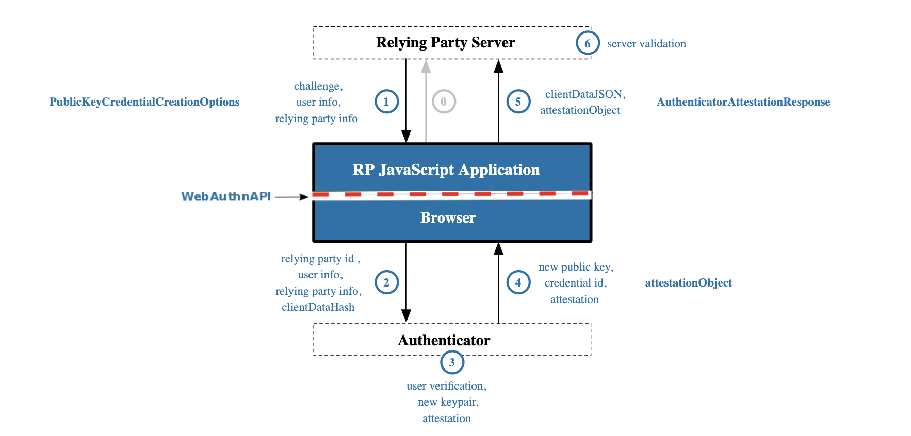

  Flujo de mensajes en el proceso de registro. <a href="https://www.w3.org/TR/webauthn/">Fuente</a>

#### Paso 0

El usuario introduce sus datos en en el formulario de registro y la aplicación JavaScript del navegador los envía al servidor. Este mensaje no entra dentro del alcance propuesto por el estándar por lo que el formato puede variar. En este ejemplo se envía una petición POST con los datos en formato JSON.

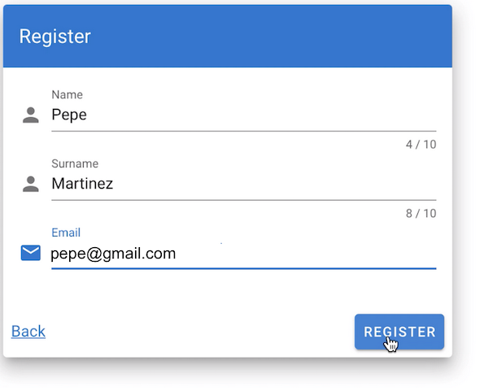

Formulario de registro de la prueba de concepto.

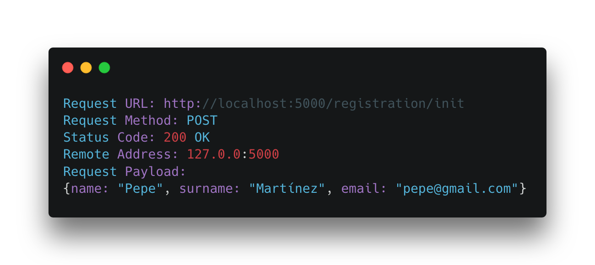

Mensaje enviado al inicio del proceso de registro.

#### Paso 1

El servidor recoge los datos del cliente, crea un _challenge_ de bytes aleatorio, de al menos 16 bytes, con el fin de evitar [ataques de replay](https://www.ccn-cert.cni.es/publico/seriesCCN-STIC/series/400-Guias_Generales/401-glosario_abreviaturas/index.html?n=97.html). Además, se añaden ciertos datos del propio servidor e información de los algoritmos deseados para la creación de las claves. Con todos esos datos, el servidor crea el objeto PublicKeyCredentialCreationOptions, que es devuelto al navegador.

El protocolo para la transmisión de todos los mensajes no está definido en la especificación, pero al igual que en el paso anterior, y los posteriores, se realiza mediante una conexión HTTP. Al ser una prueba de concepto, en nuestro caso, hemos realizado el paso de mensajes sobre una conexión HTTP (sin cifrar) para que sea sencillo de desplegar y puedan verse los mensajes que se envían fácilmente, aunque, en un entorno productivo la comunicación **debería realizarse sobre HTTPS**.

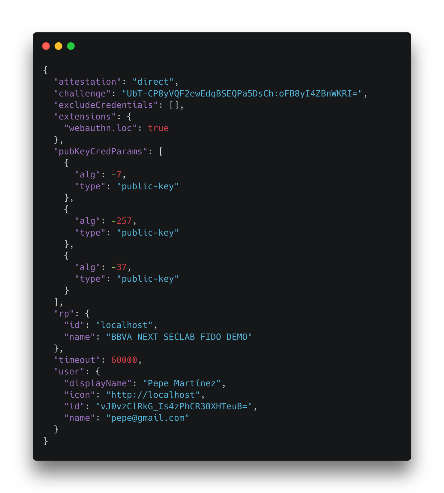

  Mensaje respuesta del servidor con el challenge y el acuerdo del algoritmo de cifrado.

#### Paso 2

El navegador llama a la función authenticatorMakeCredential() del _authenticator_. Internamente el navegador valida los parámetros y rellena algunos por defecto. Los parámetros de la llamada create() se le pasan al _authenticator_ junto con un hash SHA-256 del objeto clientDataJSON. Al método solo se le pasa el hash del objeto para no sobrecargar conexiones de baja velocidad y garantizar que no se ha alterado la información.

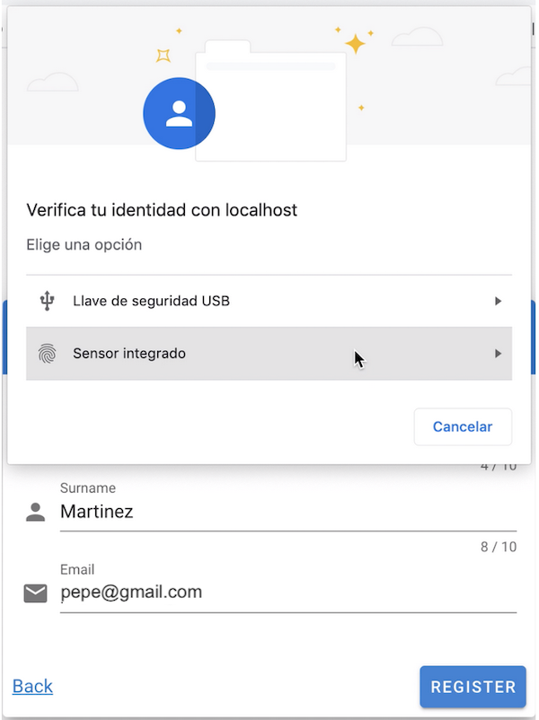

  Navegador web preguntando al usuario que método de verificación desea usar.

#### Paso 3

El _authenticator_ necesita verificar la identidad del usuario para ello le solicita que introduzca o bien su huella dactilar o su llave física externa. Una vez todo es correcto genera un par de claves pública y privada.

#### Paso 4

La clave privada se almacena, en el servidor, asociada a un Credential ID y la clave pública se devuelve al navegador junto con información del cifrado.

#### Paso 5

La aplicación JavaScript genera el objeto AuthenticatorAttestationResponse y se lo devuelve al servidor. Este objeto contiene:

- **Credential ID**: es el identificador de la credencial que ha creado el _authenticator_.
- **CliendDataJSON**: son datos del cliente. Incluye el mismo challenge que le envía el servidor.
- **AttestationObject**: contiene la clave pública, el algoritmo usado para generarla y una firma creada por el authenticator con su propia clave privada, la cual es introducida cuando este dispositivo se crea y debe ser de confianza.

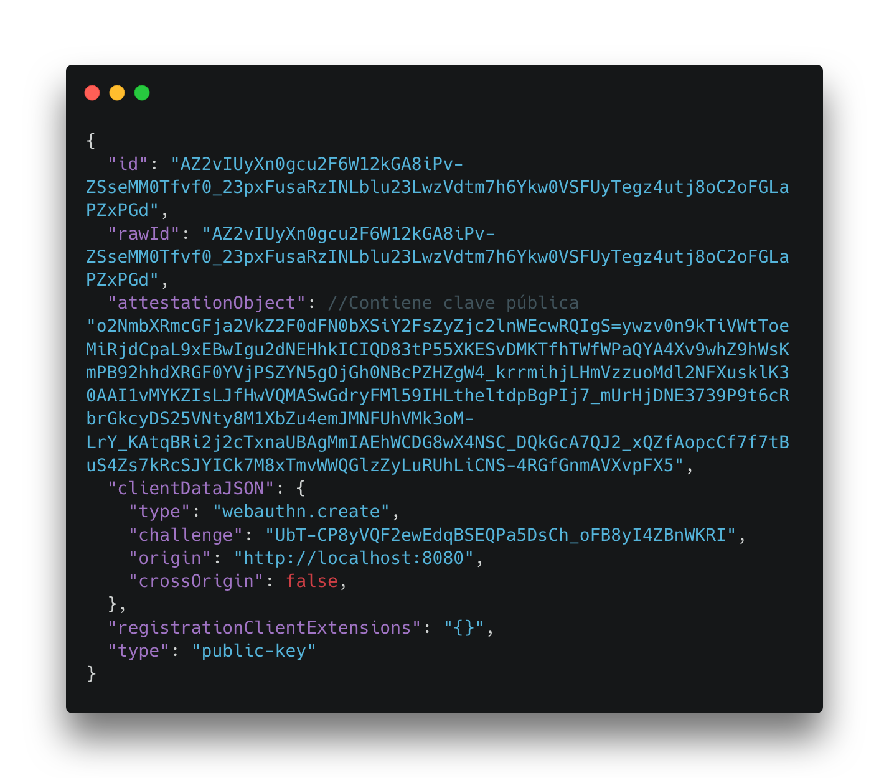

Authenticator Attestation Response creado por el navegador del usuario.

#### Paso 6

El servidor debe verificar los datos, tiene que comprobar que el _challenge_ es idéntico al enviado al navegador en el Paso 1. También se debe comprobar que la firma del _authenticator_ es válida y para ello debe de seguir la cadena de confianza de certificados correspondiente. Cuando todas las validaciones son correctas, el servidor almacena la clave pública y el Credential ID con los datos del usuario y el registro finaliza correctamente.

La prueba de concepto se ha realizado en un dispositivo Mac con huella dactilar incorporada, es por eso que ha sido necesario incluir el certificado root de Apple para que el servidor FIDO sea capaz de verificar el origen del _authenticator_ del [Mac](https://www.apple.com/certificateauthority/). Si se usa otro dispositivo, ya sea llave externa o un sistema embebido en un PC habría que añadir el certificado a la carpeta correspondiente.

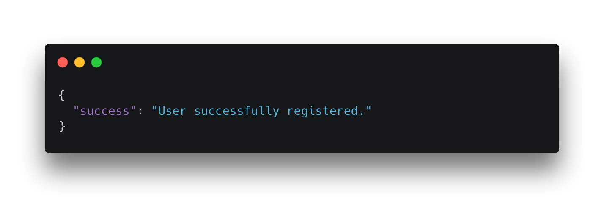

Mensaje de finalización del proceso, usuario registrado.

### Autenticación

El usuario se ha registrado en la aplicación mediante el proceso anterior. A partir de ahora, podrá identificarse en la aplicación mediante un sencillo proceso en el que entra en juego el uso de la biometría o la posesión de un token hardware. En este caso, el usuario entrará en la aplicación. La aplicación le requerirá que se identifique. Entonces el usuario seleccionará identificarse mediante FIDO y empezará el proceso de autenticación.

  Flujo de mensajes en el proceso de autenticación.{' '}
  <a href="https://www.w3.org/TR/webauthn-2/">Fuente</a>

#### Paso 0

El cliente introduce sus datos en el formulario de login y estos se envían al servidor FIDO.

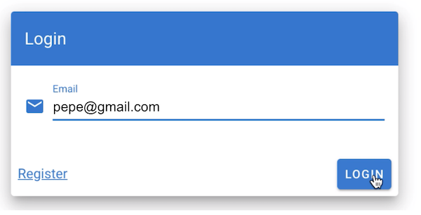

Formulario de login en la prueba de concepto.

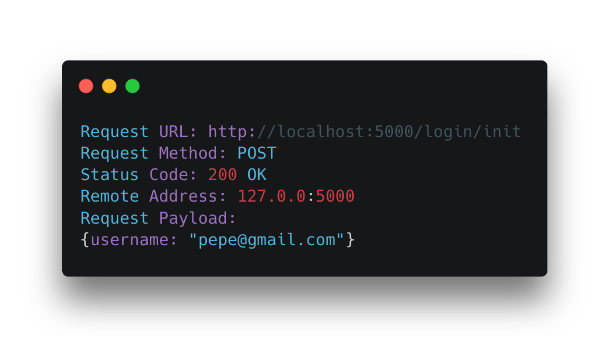

Mensaje inicial en el proceso de autenticación.

#### Paso 1

El servidor genera el objeto PublivKeyCredentialRequestOptions que contiene un challenge aleatorio y el CredentialID asociado al usuario.

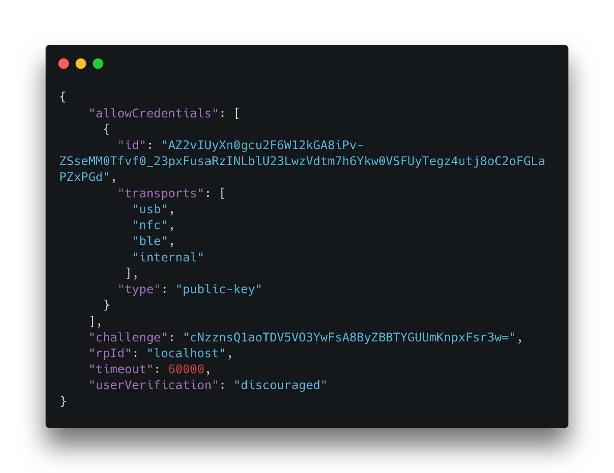

  Objeto PublivKeyCredentialRequestOptions enviado al navegador del usuario con un challenge y el
  CredentialID.

#### Paso 2

El navegador completa automáticamente algunos de los campos y llama a la función get() del _authenticator_.

#### Paso 3

El _authenticator_ solicita que el usuario verifique su identidad introduciendo su huella o su llave física. Si todo es correcto genera una firma usando la clave privada del usuario y se la devuelve al navegador junto con los datos que ha empleado para generar dicha firma.

  Arriba, notificación de sistema (MacOS) informando de que alguna aplicación pide autenticarse
  mediante el sensor de huella o contraseña. Abajo, formulario de login de la prueba de concepto.

#### Paso 4

El _authenticator_ devuelve los datos al navegador.

#### Paso 5

El navegador crea y envía el objeto AuthenticatorAssertionResponse con la firma, el clienDataJson con datos del usuario y el authenticatorData que contiene información necesaria para que el servidor pueda comprobar la firma.

  Objeto AuthenticatorAssertionResponse con que el navegador responde al servidor con la información
  necesaria para verificar la identidad del usuario.

#### Paso 6

El servidor valida la firma, para ello la descifra con la clave pública del cliente. Después calcula un hash SHA-256 del objeto clientDataJSON y lo concatena con el valor en bytes del objeto AuthenticatorData, si el resultado es igual al de la firma descifrada, se da por válido. Esta **no es la única comprobación** que hace el servidor aunque sí la más importante. Si alguna de las comprobaciones de la especificación falla, la autenticación se invalida, en caso contrario sería correcta y se le devolvería al navegador algún mecanismo para mantener la sesión. Este mecanismo está fuera del alcance de la especificación. Una opción para esto podría ser el uso de un [token JWT](https://jwt.io/).

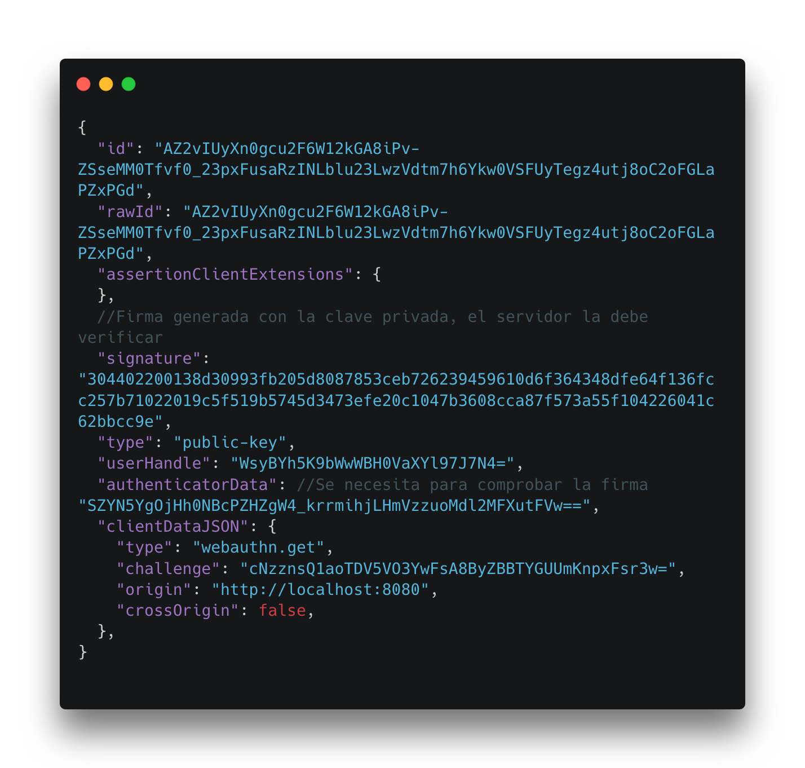

  Mensaje de finalización del proceso de autenticación junto con el token de sesión.

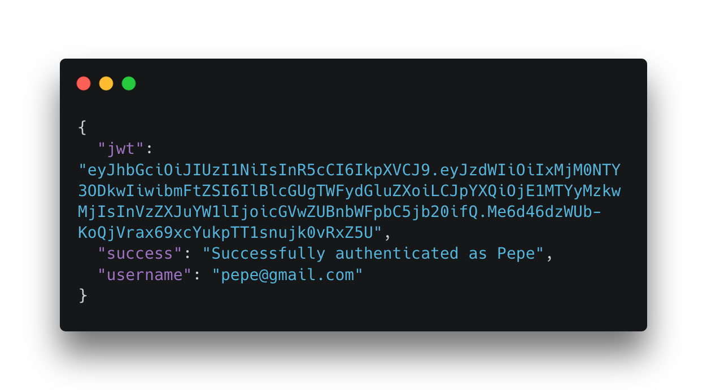

  Frontal de la prueba de concepto mostrando el resultado de la autenticación y el token de sesión.

## Conclusión

FIDO 2 es un estándar con un alto nivel de madurez que permite autenticación sin contraseñas o el uso de múltiples mecanismos de autenticación como un segundo factor a través de dispositivos externos como pueden ser las llaves físicas, los dispositivos móviles o sistemas embebidos en los propios ordenadores portátiles.

Con la definición de las distintas especificaciones un desarrollador puede incorporar fácilmente estos mecanismos de autenticación.

A pesar de la transparencia brindada por las librerías FIDO2, para poder incorporar este estándar a nuestros servicios tradicionales **es esencial conocer cuáles son las funciones del servidor FIDO2**, entender cada una de las comprobaciones que dicho servidor debe de hacer y el por qué de las mismas. En los sistemas de autenticación _passwordless_ como este, es imprescindible el **gestionar de forma adecuada las claves públicas** de los usuarios, necesarias para descifrar los mensajes durante el proceso de autenticación. Una mala gestión de estas claves podría provocar el que el usuario no pudiese autenticarse o que un atacante pudiese impersonar a un usuario de ser capaz de modificar esa clave pública.

Como se ha demostrado, existen diferentes servidores FIDO _open source_, certificados por la FIDO Alliance, que se pueden utilizar e incorporar en proyectos desarrollados en una gran variedad de lenguajes de programación así como librerías para integrar esta solución también en el lado del cliente.

Si por el contrario se quiere una solución más adaptada a un caso de negocio concreto o que cuente con servicio de soporte, se puede hacer uso de los diferentes productos comerciales de las empresas del sector, estas ofrecen diferentes alternativas y soluciones para la implementación e integración de soluciones _passwordless_ que convivan o se superpongan a otras más tradicionales ya presentes en los sistemas de la organización.

_Fuente Imagen destacada: [unsplash](https://unsplash.com/photos/WjZ4eaHq9G4)_
