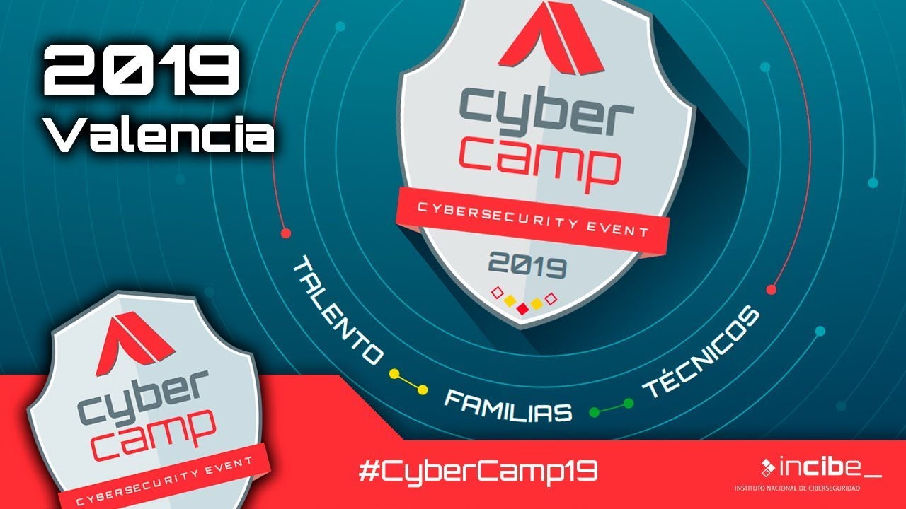
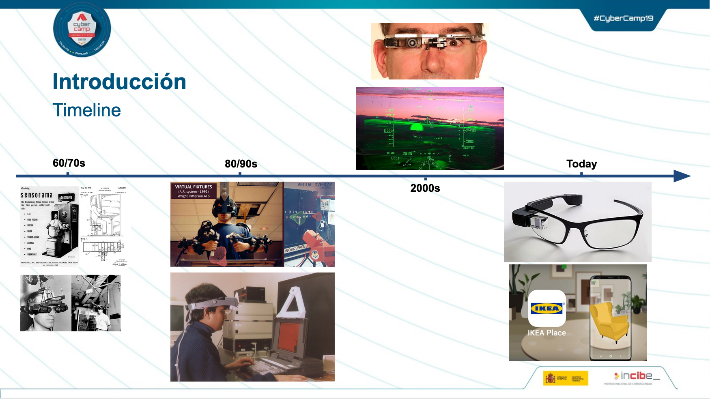
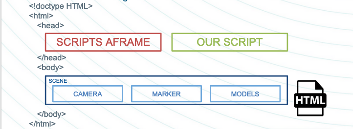
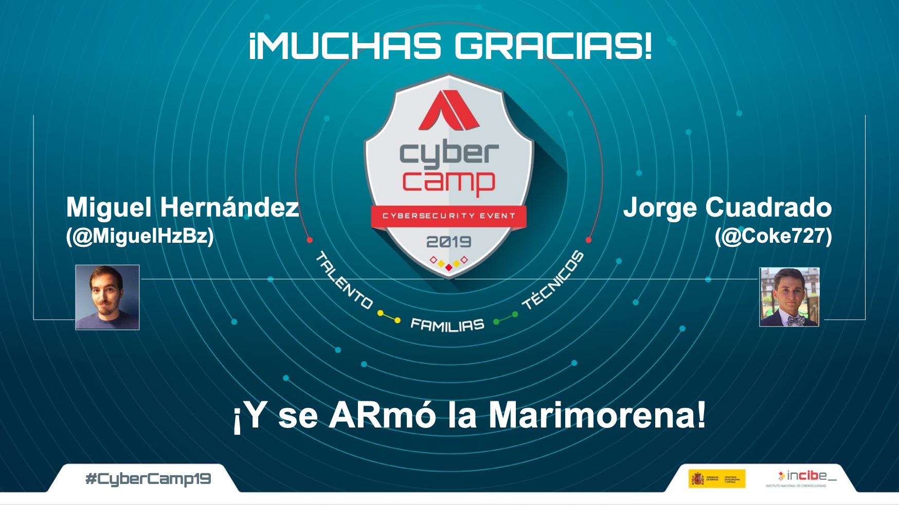

Hace dos meses [Miguel](https://twitter.com/MiguelHzBz) and I were giving a two hours workshop/talk in Valencia about augmented reality mixed with cybersecurity and the objective of improving the physical places and documents security. Cybercamp is organized by [INCIBE](https://www.incibe.es), "_Instituto Nacial de Ciberseguridad_" (National Cybersecurity Institute), which is an organization dependent on the National Ministry of Economy and Business with the aim of increasing the cybersecurity level in the digital market and cyberspace in Spain. INCIBE gives different cybersecurity services like its [CERT](https://www.incibe-cert.es/), free cybersecurity [services](https://www.incibe.es/protege-tu-empresa) for companies and cybersecurity focused on kids ([IS4K](https://www.is4k.es/)).



As INCIBE says:

<blockquote>
  CyberCamp is the major cybersecurity event that INCIBE organizes on a yearly basis for the purpose
  of identifying, appealing, managing and contributing to the creation of talent in cybersecurity
  that can be transferred to the private sector according to its demands. This initiative is one of
  the tasks that the Trust in the Digital Sphere Plan, included in the Spain’s Digital Agenda, has
  requested INCIBE to carry out.
</blockquote>

In a plain language, **Cybercamp** is a congress which wants to gather together families, students and cybersecurity professionals. Each year in one different city, Cybercamp offers technical, educational and motivational talks, workshops, cybersecurity teaching activities for kids and even a [hackathon](https://cybercamp.es/competiciones/hackathon) and a [CTF](https://cybercamp.es/competiciones/CTF) contest.

In the technical workshop category, we give a talk called _"¡Y se ARmó la Marimorena! Ciberseguridad en realidad aumentada"_ (<strike>Maria the brunette armed herself</strike>! Cybersecurity in Augmented Reality)

## What I talked about?

**Augmented Reality (AR)** is a technology that allows us to **show digital objects inside the physical reality** using a special set of glasses or a smartphone. This appealing technology is closer than ever and in this workshop we would like to anticipate the future in an exercise of innovation. You will not only learn how this technology works and some keys to keep in mind when working with it but also how to develop different solutions to make our physical spaces more secure digitally.

### Augmented Reality in context

Augmented Reality (AR) is the term used to describe the set of technologies which allows users seeing part of the real world through a technological device that adds digital information like sounds, video, graphics or GPS data. This technology appeared on 1901 when Frank L Baum uses a special set of glasses called [_"Character Maker"_](https://www.interaction-design.org/literature/article/augmented-reality-the-past-the-present-and-the-future).

As [Miguel](https://twitter.com/MiguelHzBz) stated in this timeline, during the last decade this technology has greatly improved, allowing users to get a real benefit in their daily life.



From **aircraft** and **cars** control panels to mobile applications which allows user to get more information about **monuments** or **products** the augmented reality is **inadvertently becoming our daily life context**. Like in most of the technologies, when a technology increase in importance, **cybersecurity risks** starts to become real incidents. AR is involved in the physical world, thus, it can **affect physically the world**. For example, the AR assistants of a car or a fake GPS indications can compromise the safety of the user if hacked.

If you look at the slides or the conference video, we talk about some examples were this technology represent a **threat** in privacy, marketing or vandalism. Those are not common incidents nowadays but they are incoming threats that will affect us in the future. As an example of this, [Hyper-Reality](https://youtu.be/YJg02ivYzSs) is a great **short movie** to watch.

<iframe
  width="560"
  height="315"
  src="https://www.youtube.com/embed/YJg02ivYzSs"
  frameborder="0"
  allow="accelerometer; autoplay; encrypted-media; gyroscope; picture-in-picture"
  allowfullscreen></iframe>

### Developing Augmented Reality with web technologies

AR is a quite complex technology if you are trying to start a new project using frameworks such _Unreal Engine_ or _Unity_ since you will need to prepare all the scaffolding and learn many specific concepts and tools. Keeping that in mind and with the two hours limitation for our workshop, I decided to use a simpler option, [_AR.js_](https://github.com/jeromeetienne/AR.js).

Why is this a good choice? _AR.js_ is a **Javascript library**, Javascript is a greatly spread language which is known for most of the developers. This web language allowed us to share the example applications world around without getting into troubles creating accounts in an _app_ store or compiling executable files. For sure, there are options to get these problems done in a simple and fast way but two hours is not enough time for explaining how to achieve that to a variety of people who is potentially composed by highschoolers, graduates or even families without technical knowledge.


Some time ago, I used [_Three.js_](https://threejs.org/) in one of the Laboratory researches I was involved. This was a great experience and I learnt many new concepts about 3D programing. _Three.js_ allows to create 3D applications for web environments in a simple way but it can be a little tricky to use. Years after that, I discovered _AR.js_, a library meant to create AR applications using **Aframe** and **Three.js** and after a couple of hours trying it, the decision was clear.

_Ar.js_ is extreamly **easy** to use, well documented and **powerful**. The functionality is limited because of the simplicity of the library but in that point is still possible to use _three.js_.

#### AR.js components

- **a-scene** is the virtual scenario where we place the objects.
- **a-assets** multimedia content that we want to use in the application.
- **a-marker** represents the marker where our digital content will be placed in the real world.
- **a-entity camera** point of view from where the screen is showing the model.

#### Markers

Markers are the points where digital content is placed, a marker doesn't store any information but you can use the image of a QR code as a marker, the marker is only the shape of the QR but you can also recover the information stored in that shape.


Instead of a **QRcode** or **Barcode** there are applications that can use pictures as markers or even the **coordinates** of the device which is showing the AR content. That is the case of _Pokemon GO_ or _Minecraft Earth_.

<iframe
  width="560"
  height="315"
  src="https://www.youtube.com/embed/2sj2iQyBTQs"
  frameborder="0"
  allow="accelerometer; autoplay; encrypted-media; gyroscope; picture-in-picture"
  allowfullscreen></iframe>
<iframe
  width="560"
  height="315"
  src="https://www.youtube.com/embed/tzCBCoC2bjs"
  frameborder="0"
  allow="accelerometer; autoplay; encrypted-media; gyroscope; picture-in-picture"
  allowfullscreen></iframe>

#### Application parts

Our project is a web applicatión, so, at the end we will have the same files as a normal web application:


We will need to import the aframe and AR.js scripts.

```
https://raw.githack.com/jeromeetienne/AR.js/2.0.8/aframe/build/aframe-ar.js
https://aframe.io/releases/0.9.2/aframe.min.js
```

The simplest structure will look like this one:



As an example of hello world project we will create an spinning red cube which will be shown when a [_Hiro_](https://commons.wikimedia.org/wiki/File:Hiro_marker_ARjs.png) marker appears in the camera.

```html
<!DOCTYPE html>
<html lang="en" dir="ltr">
  <head>
    <script src="https://aframe.io/releases/0.9.2/aframe.min.js"></script>
    <script src="https://raw.githack.com/jeromeetienne/AR.js/2.0.8/aframe/build/aframe-ar.js"></script>
  </head>
  <body>
    <a-scene embedded arjs="trackingMethod: best; debugUIEnabled: false">
      <a-marker preset="hiro">
        <a-box position="0 1 0" material="color: red;">
          <a-animation
            attribute="rotation"
            dur="2000"
            fill="forwards"
            from="0 0 0"
            to="360 360 360"
            repeat="indefinite"
          >
          </a-animation>
        </a-box>
      </a-marker>
      <a-entity camera></a-entity>
    </a-scene>
  </body>
</html>
```

And thats all, 19 lines only and there we have an AR web application. If you want to continue creating AR applications with AR.js you can watch the record of the workshop dubbed to english here:

<iframe
  width="560"
  height="315"
  src="https://www.youtube.com/embed/TJirrht7MuQ"
  frameborder="0"
  allow="accelerometer; autoplay; encrypted-media; gyroscope; picture-in-picture"
  allowfullscreen></iframe>

Also you can access the code of the three proofs of concepts **[here](https://github.com/jorcuad/Cybercamp2019-SecurityAR-Workshop)**.

Apart of the workshop, this year I also participated in the cybersecurity hackathon. After three days of non stop coding we managed to achieve our objectives for the second versión of [ASSAP](https://github.com/assap-org/assap/). We got the **third price**! I will write another post talking about ASSAP and the competition in the next weeks.

## The Slides

If you want to see **more** about the presentation, I encourage you to take a look on the **[slides](https://drive.google.com/open?id=1sH-SjuVkZ67sR6k7g4E_DoGPN9EJdJE6b6nxHV4Fn8E)** of the talk.

**Thanks** for reading this post. If you have any **question**, annotation or you only want to say hello... you can **contact** me in [Twitter](https://twitter.com/coke727), a comment in this post or using smoke signals =P



**Don't doubt asking me any question using the comments or my mail in the home page.**
