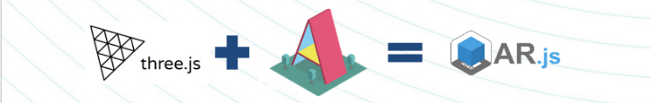

Hace dos meses [Miguel](https://twitter.com/MiguelHzBz) y yo dimos una charla-taller de dos horas en Valencia. Esta ponencia trató sobre realidad aumentada mezclada con ciberseguridad y con el objetivo de mejorar la seguridad digital de los documentos y entornos físicos. Cybercamp es un congreso organizado por [INCIBE](https://www.incibe.es), "Instituto Nacial de Ciberseguridad", es una organización dependiente del Ministerio de Economía. El objetivo del congreso es el de mejorar la seguridad en el entorno digital de España. INCIBE da diferentes servicios de ciberseguridad como los de [CERT](https://www.incibe-cert.es/), [servicios gratuitos](https://www.incibe.es/protege-tu-empresa) para empresa y otros enfocados para niños ([IS4K](https://www.is4k.es/)).


Como dice INCIBE:

<blockquote>
  CyberCamp es el gran evento gratuito de ciberseguridad anual organizado por el Instituto Nacional
  de Ciberseguridad de España (INCIBE) en el que, a través de un amplio programa de actividades, se
  pretende ofrecer contenidos de interés para todos los públicos.
</blockquote>

En resumen, **Cybercamp** es un congreso que busca reunir familias, estudiantes y profesionales. Cada año en una ciudad diferente, Cybercamp ofrece chalar técnicas, divulgativas, motivacionales o tallers para todas las franjas de edad e incluso un [hackathon](https://cybercamp.es/competiciones/hackathon) y una competición de [CTF](https://cybercamp.es/competiciones/CTF).

En la categoría de taller técnica, impartimos la charla _"¡Y se ARmó la Marimorena! Ciberseguridad en realidad aumentada"_

## ¿De qué estuvimos hablando?

La **Realidad Aumentada (AR)** es una tecnología que nos permité **mostrar objetos digitales dentro del mundo físico** usando gafas especiales o un _smartphone_. Esta tecnología tan espectacular está cada vez más cerca y en este taller queremos anticiparnos al futuro en un ejercicio de innovación. No solo aprederás cómo funciona esta tecnología y las claves para trabajar con ella, sino que, desarrollaremos diferentes soluciones tecnológicas que volverán más seguros digitalmente tus entornos físicos.

### Realidad Aumentada en contexto

La Realidad Aumentada (AR) es un termino usado para describir un conjunto de tecnologías que permiten al usuario el ver parte del mundo real a través de dispositivos que añaden información digital sonidos, videos, gráficoso o datos GPS. Esta tecnología apareció en 1901 cuando Frank L Baum usa unas gafas especiales llamadas [_"Character Maker"_](https://www.interaction-design.org/literature/article/augmented-reality-the-past-the-present-and-the-future).

Como muestra [Miguel](https://twitter.com/MiguelHzBz) en esta línea temporal, durante la última década AR ha evolucionado mucho y permite a los usuairos obtener un beneficio real en su vida diaria.


Desde los paneles de control de **aviones** y **coches** hasta aplicaciónes de móvil, permite a los usuarios obtener información sobre **monumentos** o **productos**. La realidad aumentada es **poco a poco introduciendose en nuestra vida diaria**. Como en la mayoría de las tecnologías, cuando su importancia crece, los **riesgos de cyberseguridad** empiezan a convertirse en incidentes reales. AR trata con el mundo físico, lo que implica que, **puede afectar al mundo físico**. Por ejemplo, los asistentes GPS de los coches si reciben señales GPS falsas pueden poner en peligro la seguridad de los usuarios en caso de ser hackeados.

Si miras la presentación que usamos en el taller, dimos varios ejemplos sobre esta tecnología que suponen una **amenaza** a nuestra privacidad, _marketing_ o vandalismo. Ahora mismo estos no son incidentes comunes, pero son riesgos emergentes que nos afectaran en un futuro. A modo de ejemplo, [Hyper-Reality](https://youtu.be/YJg02ivYzSs) es un gran **corto** para ver.

<iframe
  width="560"
  height="315"
  src="https://www.youtube.com/embed/YJg02ivYzSs"
  frameborder="0"
  allow="accelerometer; autoplay; encrypted-media; gyroscope; picture-in-picture"
  allowfullscreen></iframe>

### Desarrollo de una aplicación AR con tecnología web

AR es una tecnología compleja y si quieres empezar un nuevo proyecto usando _frameworks_ como _Unreal Engine_ o _Unity_ necesitarás preparar un _scaffolding_ y aprender muchos conceptos específicos y herramientas. Teniendo esto en mente y con un taller que no puede durar más de dos horas, hemos decidido usar una opción más limitada pero más simple, [_AR.js_](https://github.com/jeromeetienne/AR.js).

¿Por qué es una buena opción? _AR.js_ es una **librería JavaScript**, JS es un lenguaje muy usado y rd más probable que alguién que asista al taller lo conozca. Este lenguaje nos va a permitir compartir nuestros ejemplo mediante internet sin entrar en problemas de crear cuentas en una _app store_ o compilar los ejecutables. Por supuesto, hay opciones que solucionan estos problemas de forma sencilla y rápida pero en dos horas no nos daría tiempo a explicar como conseguirlo a una público de perfil muy variado en el que pueden haber desde estudiantes de instituto, universitarios familias y hasta profesionales.



Hace tiempo, use [_Three.js_](https://threejs.org/) en una de las investigaciones del laboratorio. Fue una experiencia muy positiva y aprendí muchos conceptos sobre programación 3D. _Three.js_ permite crear aplicaciones 3D para entornos web de forma simple, aunque, puede resistirse un poco en algunas cosas. Años después, descubrí _AR.js_, una librería enfocada en crear aplicaciones AR usando **Aframe** y **Three.js** y después de unas horas de pruebas, la decisión estaba clara.

_Ar.js_ es extremadamente **fácil** de usar, bien documentado y muy **potente**. La funcionalidad es limitada por su simplicidad de uso, pero en ese punto pueden usarse funciones de _three.js_ que corre por debajo.

#### Componentes de AR.js

- **a-scene** es el escenario virtual donde se colocan los objetos.
- **a-assets** contenido multimedia que queremos usar en la aplicación
- **a-marker** representa el lugar donde del mundo real donde se coloca el contenido digital.
- **a-entity camera** posición y enfoque de la cámara desde la que se ve el modelo digital.

#### Marcadores

Los marcadores son los puntos donde el contenido digital se coloca, no almacenan información y pueden ser una imagen o código QR, el marcador es solamente la forma del QR pero se podría obtener información si la almacenase.


En vez de usar un **código QR** o un **código de barras** hay aplicaciones que usan fotos como marcador o incluso las **coordenadas GPS** del dispositivo que está mostrando el contenido AR. Ese es el caso de _Pokemon GO_ or _Minecraft Earth_.

<iframe
  width="560"
  height="315"
  src="https://www.youtube.com/embed/2sj2iQyBTQs"
  frameborder="0"
  allow="accelerometer; autoplay; encrypted-media; gyroscope; picture-in-picture"
  allowfullscreen></iframe>
<iframe
  width="560"
  height="315"
  src="https://www.youtube.com/embed/tzCBCoC2bjs"
  frameborder="0"
  allow="accelerometer; autoplay; encrypted-media; gyroscope; picture-in-picture"
  allowfullscreen></iframe>

#### Partes de la aplicación

Nuestro proyecto es una aplicación web, por lo tanto, al final tendremos los mismo archivos que en una aplicación web tradicional:


Necesitamos importar los _scripts_ de AFrame y AR.js.

```
https://raw.githack.com/jeromeetienne/AR.js/2.0.8/aframe/build/aframe-ar.js
https://aframe.io/releases/0.9.2/aframe.min.js
```

La estructura de la web se vería como esta:


Como primer ejemplo vamos a crear un _Hola Mundo_ en el que se va a ver un cubo rojo girando cuando se enfoque con la cámara un marcador tipo [_Hiro_](https://commons.wikimedia.org/wiki/File:Hiro_marker_ARjs.png).

```html
<!DOCTYPE html>
<html lang="en" dir="ltr">
  <head>
    <script src="https://aframe.io/releases/0.9.2/aframe.min.js"></script>
    <script src="https://raw.githack.com/jeromeetienne/AR.js/2.0.8/aframe/build/aframe-ar.js"></script>
  </head>
  <body>
    <a-scene embedded arjs="trackingMethod: best; debugUIEnabled: false">
      <a-marker preset="hiro">
        <a-box position="0 1 0" material="color: red;">
          <a-animation
            attribute="rotation"
            dur="2000"
            fill="forwards"
            from="0 0 0"
            to="360 360 360"
            repeat="indefinite"
          >
          </a-animation>
        </a-box>
      </a-marker>
      <a-entity camera></a-entity>
    </a-scene>
  </body>
</html>
```

Eso es todo, sólo 19 líneas y ya tenemos una aplicación AR. Si quieres continuar creando aplicaciones AR con AR.js, puedes ver la grabación del taller, esta en español e inglés:

<iframe
  width="560"
  height="315"
  src="https://www.youtube.com/embed/TJirrht7MuQ"
  frameborder="0"
  allow="accelerometer; autoplay; encrypted-media; gyroscope; picture-in-picture"
  allowfullscreen></iframe>

Puedes ver el código de todas las pruebas de concepto qeu enseñamos ese día **[aquí](https://github.com/jorcuad/Cybercamp2019-SecurityAR-Workshop)**.

A mayores del taller, este año hemos participado en el Hackathon de Cybercamp. Después de tres días sin parar de programar hemos conseguido alcanzar nuestros objetivos para la segunda versión de [ASSAP](https://github.com/assap-org/assap/). ¡Hemos conseguido el **tercer premio** Escribiré otro post hablando sobre ASSAP y esta competición más adelante.

## Las diapositivas

Si quieres ver **más** sobre esta presentación, te animo a ver las **[diapositivas](https://drive.google.com/open?id=1sH-SjuVkZ67sR6k7g4E_DoGPN9EJdJE6b6nxHV4Fn8E)** de la charla.

**Gracias** por leer este artículo. Si tienes alguna **duda**, comentario o simplemente quieres decir un hola... puedes **contactarme** en [Twitter](https://twitter.com/coke727), el formulario de contacto o incluso señales de humo =P


**No dudes en preguntarme cualquier duda vía Twitter, email o el formulario de la página principal.**
