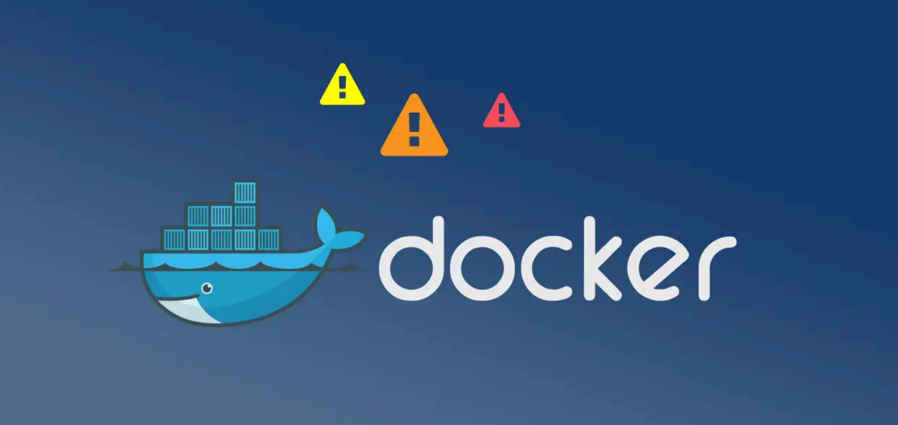
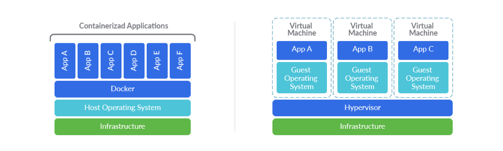
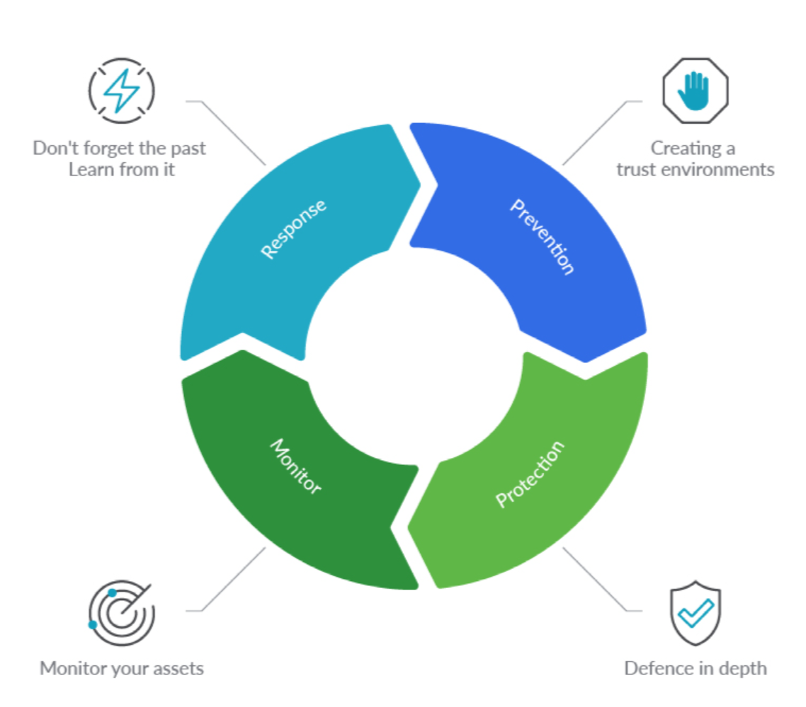
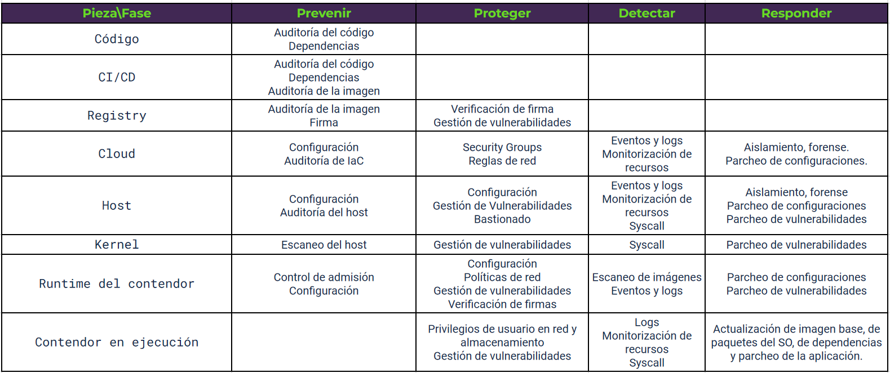
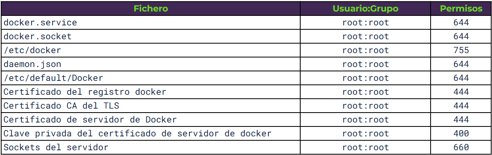

<div class="caption">
  Fuente: 
  <a href="https://reconshell.com/container-security-checklist/">Reconshell</a>.
</div>

Docker is a widely used technology, but in most cases, the security and bastioning policies of the infrastructures that base their operation on these containers are not taken into account.

After reading multiple articles, books and playing with containers over the last few years, I have decided to make a small guide that summarizes the notes I have been taking over the years. I'm sure I've left out a lot of techniques and basing policies along the way, but I think this article can save a lot of time for someone who wants to get into the security aspects of Docker.

This post takes into account industry best practices for developing applications inside Docker containers. For this purpose, materials from different companies specialized in the development of security solutions for containers and the CIS guide for Docker CE 1.3.1 (currently in its version 1.5.0) have been used.

I have tried to reference all the content, however, I had not approached my notes as an article from the very beginning. That is why I have omitted some parts of my notes, in which I consider, that it is not correct to share that content without its reference. In any case, thanks to the community for the content.

## Índice

* 1_ Introduction
* 2_ Container security
* 3_ Matrix of good practices
* 4_ Image audit
  * 4.1_ Best practices
  * 4.2_ .dockerignore file
  * 4.3_ Multiple compose files
  * 4.4_ Permissions of configuration files
  * 4.5_ COPY instead of ADD in the Dockerfile
  * 4.6_ Static vulnerability scanning
  * 4.7_ Exposed ports
* 5_ Image integrity
  * 5.1_ Latest
  * 5.2_ Checking for changes between container and image
  * 5.3_ Docker Content Trust
  * 5.4_ Docker Registry
  * 5.5_ Image signing
* 6_ Configuration Errors and Remediation
  * 6.1_ DNS
  * 6.2_ Environment variables
  * 6.3_ Privileged port mapping inside containers 
  * 6.4_ Docker Bench Security
* 7_ Host auditing
  * 7.1_ Creating separate partitions for containers 
  * 7.2_ Limiting the use of containers
  * 7.3_ Authentication in the Docker client
* 8_ Permissions of the image in runtime
  * 8.1_ User
  * 8.2_ Remove setuid and setgid permissions
  * 8.3_ Networking
  * 8.4_ Restrict the traffic between containers
  * 8.5_ Resource usage
  * 8.6_ Enable SELinux/AppArmor
  * 8.7_ Restriction of Linux capabilities in the container 
  * 8.8_ Do not allow the execution of privileged containers
  * 8.9_ Don't enable SSH in the container
* 9_ Vulnerability management
* 10_ Monitoring
  * 10.1_ Centralized/remote log management
* 11_ Incident isolation and investigation 
* 12_ Vulnerability patching
* 13_ References

## 1. Introduction

Docker is a containerization technology that allows applications to be deployed by abstracting from the operating system running underneath. Although they may seem similar, virtualization and containerization are technologies with different uses and qualities.

In the case of containers, a complete operating system is not emulated, which makes containers faster and smaller than a virtual machine. Another clear difference is in management, virtual machines require a _hypervisor_ (VMM) that manages the resources of the host computer for the different virtual machines. On the other hand, Docker uses a shared kernel and the user interacts with containers via APIs and command line. 

Containers are directories isolated from the rest of the file system through the use of user permissions. The container is a file system within the operating system, "caged" so that it can only be exited from the container through points defined in the container's manifest.


<div class="caption">
  Stack comparison in containers and virtual machines. Source:  
  <a href="https://sysdig.com/blog/container-security-best-practices/">Sysdig</a>.
</div>

When creating a container, you must first define an image, a binary file where you define all the libraries necessary for the execution of the application you want to _containerize_. A container can be executed by adding all the libraries of an operating system, such as Ubuntu, or by adding only the minimum necessary libraries, such as Alpine or Busybox. 

The image also contains metadata, dependencies, requirements and file system details that act as a template to be used by the containers. This allows you to version the containers and configure their deployment in an automated way (also their removal or scaling policies) using other compatible tools such as Jenkins, a _registry_ or kubernetes.

A container is OS independent and that has many advantages. Among them, the patching and bastioning of servers. Changes made to server operating systems will rarely affect the container. In automated systems, vulnerability patching is done by removing the server, reinstalling the most updated version of the operating system with all the patches, and then re-installing the container again.

## 2. Containter security

A container should be completely isolated from the server, being a security layer that prevents an attacker taking control of an application from leaving the container or jumping to other servers on the network. However, this is a utopian goal. It is intended to become so, but the reality is not so kind.

An attacker exploiting a vulnerability within a container, combined with exposed metadata and a poorly secured credential can compromise an entire cloud infrastructure.

As mentioned above, containers are not a virtual machine, they are a self-contained application delivery system that allows processes to run in isolation from the rest of the system. This isolation uses kernel namespaces to avoid emulating a complete operating system as a virtual machine would do. These missing abstraction layers, and the closeness to the kernel, can allow an attacker to break out of or into the container on a misconfigured container.

Container security best practices include the host system, the container runtime environment, the cluster, the infrastructure provider, monitoring, image bastioning, incident response...


<div class="caption">
  Container safety management cycle. Source:  
  <a href="https://sysdig.com/blog/container-security-best-practices/">Sysdig</a>.
</div>

This implies that we must consider the entire stack in order to secure a container infrastructure at all points in its lifecycle.

### 3. Matrix of good practices


<div class="caption">
  Matrix of good practices according to the safety management cycle. Source:  
  <a href="https://sysdig.com/blog/container-security-best-practices/">Sysdig</a>.
</div>

### 4. Image audit

__4.1 Good practices__
* Use small images such as Alpine, Busybox or Scratch (or create them yourself).
* Use specialized images. If you need to deploy an Apache server, it is advisable to use a specialized Apache image rather than one with Ubuntu or Debian as it will be smaller and more efficient.
* Specify the version of the base image. If we want to run a python2.x application and we define our image to be Ubuntu:Latest, Ubuntu may eventually stop supporting python2.x and we may find that python3 causes problems when running the application. It is recommended that you download Ubuntu:16:04 or a version specific image to avoid this.
* Reduce the number of instructions in the Dockerfile. For each instruction, Docker creates a layer that will later have to join with the rest of the layers in a consistent state. The fewer layers the less time this process will take.
* Delete unnecessary files. If we download a .tgz library when creating the container, once the library is installed it is advisable to delete the .tgz to reduce the size of the image.
* Take advantage of the multiphase image creation functionality.
* Reduce the files sent to the Docker daemon with .dockerignore.
* The order of the instructions in the dockerfile is important. Docker creates a layer for each new instruction in the dockerfile. Before creating it checks if it already exists in another dockerfile to get it from the cache. If it detects that a layer has changed, it invalidates the cache for all subsequent instructions. It is recommended to execute the instructions that are most unlikely to change first.
* Reuse images. Docker will share the same image through the cache, saving space. Recommended when several components run on the same host.

__4.2 .dockerignore file__

This is a file that is processed by the Docker daemon when processing the context. Docker ignores all files and directories listed in it. It allows to remove all unnecessary objects when creating the image. This allows the image to take up less space and speeds up its creation.

__4.3 Multiple Compose files__

By default, Docker Compose looks for the `docker-compose.yml` file, plus a second file called `docker-compose.override.yml`. This second file extends or overwrites the configuration of the first one. With `-f` it is possible to use override files with specific names such as `docker-compose.test.yml` in which we configure the opening of ports and special permissions for the _test_ or development environment or even for the use of the application by administrators or a specific client. For example:

```
$ Docker-compose -f Docker-compose.yml -f docker-compose.admin.yml -f docker-compose.clientA.yml run <servicename> <command>
```

This would allow us to deploy a container environment specific to _client A_ and ready to be used by administrators.

In this way, we avoid deployment errors and can automate specific business cases.

__4.4 Permissions of configuration files__


<div class="caption">
  Table of the configuratión files permissions. Fuente:  
  <a href="https://0xword.com/es/libros/103-docker-secdevops.html">Docker: SecDevOps</a>.
</div>

__4.5 COPY instead of ADD in the Dockerfile__

There are two instructions for copying a host system file to a container, `COPY` and `ADD`. `COPY` can only copy files from the local machine where the image is built to the filesystem of the image itself. `ADD` can retrieve files from remote URLs and unzip the contents automatically.

They are very similar, but `COPY` should be favored more, `ADD` adds many potential vulnerabilities in its use.

__4.6 Static vulnerability scanning__

A static analysis of the _Dockerfile_ can be defined, but it is not until the image is built, when libraries and dependencies are downloaded, that the security can be verified. As the images are immutable, it is very interesting to perform the static analysis on a built image. Some tools are:
* OpenSCAP
* Clair
* Anchore
* Dagda

__4.7 Exposed ports__

The `EXPOSE` command in the _Dockerfile_ is an informative command that allows us to document the ports exposed in our container. It is not mandatory, but it is highly recommended.

### 5. Integridad de la imagen

__5.1 Latest__

When tagging an image, _latest_ is a confusing tag that can cause errors and should be avoided. In production environments it is recommended that a particular version is used and that at every change the version is updated to a different one, even for minor changes. This is important because Docker also keeps a cache and in case of seeing the same version it might not download dependencies that have changed. In case of using an unversioned image (_latest_) it is recommended to do a `$ docker image pull <image name>` to force the download of the latest version in case it is not the local one.

An image can be tagged during image creation or with `$ docker image tag <tag>`.

__5.2 Comprobar cambios entre el contenedor y la imagen__

The image is a file that acts as a template when creating a container. It is immutable. However, containers have a life cycle where internal elements of the container may change. Many times, it is important to check what things have changed in order to detect anomalies, malfunctions or intrusions. To do this, you can run the command:

```
$ docker container diff <container name>
```

In the command output, A means that the file has been created, C that the file has been modified and D that the file has been deleted.

__5.3 Docker Content Trust__

The `SHA256` hash of both Docker images and their layers allows us to verify the integrity of the content. 

To do this, Docker allows to sign the images when building them and to verify the signatures when they are downloaded from a registry where we have published them.

To enable this we need to give value to the variables:

* `DOCKER_CONTENT_TRUST`
* `DOCKER_CONTENT_TRUST_SERVER`

__5.4 Docker Registry__

Within development environments a new piece of CI/CD necessities emerges, the Docker Registry. It is a repository of Docker images available based on tags and versions. When an image is built, different functional, security and performance tests are passed and if it passes, the image is published in the _registry_. From that moment on, the image can be downloaded and used by all the people and automatism with access to the _registry_. The _registry_ can be public or private. Together with the immutability of the images, it ensures that the same code is always executed in all environments.

__5.5 Image signing__

Once the image has been created, the different security and functionality checks and tests have been performed and it is ready to be distributed and deployed, the image must be signed. This is to ensure that the image we download from the _registry_ is the one we create and not a malicious copy.

To sign the images we can use __Notary__, this tool is used to publish and verify content (not only Docker images) in insecure networks.

### 6. Configuration Errors and Remediation

__6.1 DNS__

Docker allows you to configure the DNS that the containers will call to resolve domains. In the case of Iberpay they are 10.46.30.100 and 10.46.30.200.

```
docker containter run --dns=”10.46.30.100” -it ubuntu
```

__6.2 Environment variables__

Docker allows to generate files with environment variables, by default this file is called `.env`.

A bad practice is to use them to store passwords, API keys, tokens, etc. Docker implemented a feature called _secrets_ to store these values.

They can be easily seen if we use the command:

```
$ Docker history <imagename>
```

To avoid exposing secrets to third parties, the provisioning of secrets is delegated to a specific service. One option is to do it through the container orchestrators themselves (Kubernetes, Docker Swarm, OpenShift...) Another option is that the containers, in their startup phase, retrieve the secrets from a centralized point or KMS (Lemur or Vault).

__6.3 Privileged port mapping inside containers__

Ports below 1024 are privileged ports. You need root permissions to make use of them. Docker allows mapping a container port to a privileged port (the Docker daemon allows it because it has _root_ privileges).

If port mapping is not specified, Docker assigns a random one between 49153 and 65535 of the _host_.

A good practice is not to allow a container port to be associated with a privileged port on the machine unless there is no other choice.

__6.4 Docker Bench Security__

It is a tool that performs tests to verify compliance with good security practices. All tests are automatic and are based on the Docker CE CIS guide. It is recommended to run it before deploying the container. There are others such as __Kube-hunter, Linux-Bench, OSQuery, OVAL or Docker-bench__.

### 7. Host auditing

__7.1 Creating separate partitions for containers__

Docker needs to store on the host the images it downloads, the filesystem of each container, the metadata for the operation of each container. By default they are stored in `/var/lib/Docker`, mounted in `/` or `/var`. This can cause the _host_ storage space to fill up. It is recommended to mount that directory on a different partition so as not to affect the _host_.

__7.2 Limiting the use of containers__

The Docker daemon requires root permissions. This daemon controls and limits container access to the _kernel_ of the _host_. By default only the _root_ user has permission to control the daemon.

When a user is added to the Docker group, which initially only _root_ has access to. That user will be able to get _root_ permissions on the _host_ machine. This would be done by creating a container with a volume mapped to `/` on the host machine. Thus getting permissions on the entire _FS_ of the _host_ machine from the container.

You can see the users in the Docker group with the command:

```
$ getent group docker
```

__7.3 Authentication in the Docker client__

By default, Docker client authentication is done with the user's membership in the Docker group. Another more secure option is to authenticate the user using a certificate on the client. To do this, the Docker daemon must be started by listening on a TCP socket with TLS authentication enabled. Using the Common Name field of the certificate you can authenticate the user and apply authorization policies using plugins.

This authentication method does not require the user to be in the OS Docker group or root privileges. This implies that with the certificate any command can be executed on the Docker daemon. It is imperative that this certificate is securely guarded.

There are many plugins to manage this type of authentication, one of them is Twistlock, this can be run as another container on the host.

### 8. Permissions of the image in runtime

__8.1 User__

If no default user is set, Docker runs the image and commands as _root_. If the user is set, but not the group, then the default group is _root_. This implies that, if someone manages to exploit a container vulnerability and exit the container, they will enter the server being _root_. When the process running in the container does not need privileges, it is recommended that a user be used for that purpose.

To do this, you can add this in the Dockerfile.

```
RUN useradd -d /home/myuser -m -s /bin/bash myuser
USER myuser
```

Just as there may only be the _root_ user, it may be the case that there are users that are not being used or have _root_ permissions unnecessarily. It is a good practice to remove unused permissions and users.

__8.2 Remove setuid and setgid permissions__

These are special permissions that are assigned to directories or files that allow non-root_ users to execute those files with _root_ privileges to perform that specific task.

It is good practice to remove these permissions from directories where they are not needed to prevent privilege escalation by an attacker. They can be removed during the image build phase:

```
RUN find / -perm + 6000 -type f -exec chmod a-s {} \; || true
```

__8.3 Networking__

When running a container, Docker gives us different network drivers for the container.

__Bridge mode__

Connects all containers by default in the same private network. Isolates from the network layer of the _host_ with its own _namespace_ and network addressing. It is considered the most secure configuration but can only be used when the service deploys all its containers on a single _host_. 
To give access to the Internet, or to make the containers visible on the network, it is necessary to use NAT and port forwarding. Using this mode it is possible to have several services with different IPs but using the same port, port mapping will avoid conflicts.

In this example we run a container that maps by NAT the port 80 of the container with the port 12000 of the _host_.

```
$ docker container run -itd –name myserviceo -p 12000:80 httpd
```

This is a good network configuration for simple applications that only need one _host_.

We can see the containers on the bridge network with:

```
$ docker network inspect bridge
```

__Host mode__

It is the opposite of _bridge_. The isolation of the network layer of the container disappears and it will share the network _namespace_ with the _host_. If we use this option, the container is automatically exposed on the network the _host_ is on. Two containers will not be able to use the same port on the same _host_ and calls between them will be via _localhost_.
Network resources are used more efficiently. This is a recommended configuration for environments that need to optimize the use of network and execution resources to the maximum.

The container has access to all network interfaces of the machine, this is dangerous and should be avoided.

__Overlay__

It is designed for environments with more than one _host_. It is used to create clusters in Docker Swarm. It allows to encrypt communications with the -opt encrypted parameter.

__MacVLAN__

Allows to configure several type 2 layers on a single physical interface, allows to create several virtual network sub-interfaces (VLAN) with different MACs and IPs on each interface.

__8.4 Restrict the traffic between containers__

By default, network traffic between machines on the same _host_ is enabled. If not required, you can restrict all traffic between machines that is not explicitly defined.

```
$ dockerd --icc=false
```

In case the container is compromised, an attacker will not be able to communicate with other containers on the _host_ that have not been specified. But if there is a port on the _host_ that has been mapped to the container, the attacker will be able to use it.

__8.5 Resource usage__

A container will use all the resources of the _host_ machine if it is not limited. You can check if the _host_ supports this functionality with the command:

```
$ docker info
```

If an unsupported warning appears, it can be enabled in the `/etc/default/grub` file by modifying the `GRUB_CMDLINE_LINUX` line with:

```
GRUB_CDMLINE_LINUX=”cgroup_enable=memory swapaccount=1”
```

```
$ sudo update-grub
```

To limit the memory that the container can use there is the `-m` option and for the cpy the `--cpus` parameter. There are many commands to limit resources in a more concrete way.

__8.6 Enable SELinux/AppArmor__

They are systems for managing and controlling access to system resources. They seek to reach the minimum necessary privilege without implementing complex paradigms. They allow you to list which resources a user or process can access, avoiding any behavior not allowed by your policies.
They allow the implementation of security paradigms such as MAC (Mandatory Access control), MLS (Multi-Level security), RBAC (Role based Access control) or TE (Type enforcement).

__8.7 Restriction of Linux capabilities in the container__

By default Docker restricts Linux _capabilities_ of running containers. It is possible to add or remove additional capabilities. It is a good practice to remove all the ones that are not needed. The default capabilities are:

* AUDIT_WRITE
* CHOWN
* DAC_OVERRIDE
* FOWNER
* FSETID
* MKNOD
* KILL
* NET_BIND_SERVICE
* NET_RAW
* SETFCAP
* SETUID
* SYS_CHROOT

__8.8 Do not allow the execution of privileged containers__

Containers can be run `--privileged`. This gives them permission to use all Linux capabilities. By doing this, the container gets almost all the execution permissions of the _host_, even allowing to run Docker inside Docker. You should NEVER need to run a container this way.

__8.9 Don't enable SSH in the container__

It is not necessary to enable SSH, Docker provides methods to access inside the container through its API. The good practice is to log into the server and from the server access the container through the Docker client. If an SSH server exists in the container, it should be uninstalled.

### 9. Vulnerability management

Vulnerability management in a container is no different from how it is done in other systems. Once the vulnerabilities in the container are known, the ones that need to be fixed most urgently should be prioritized. Prioritization can be based on whether public exploits exist, whether they can be executed remotely, whether they are easy to exploit, and whether intelligence reports warn that they are commonly used.

There should be a procedure for systematizing vulnerability remediation that makes it easy for developers to schedule these jobs.

Create exceptions for vulnerabilities that have no impact. This reduces noise and allows prioritizing and focusing on more critical vulnerabilities.

### 10. Monitoring

__10.1 Centralized/remote log management__

Docker has an API to get the logs, via terminal you can execute:

```
$ Docker logs <container>
```

Docker supports multiple log drivers that can be configured depending on the infrastructure.

* None
* Json-file
* Syslog
* Journald
* Gelf
* Fluentd
* Awslogs
* Splunk
* Etwlogs
* Gcplogs

### 11. Incident isolation and investigation

In the event of an incident, containers must be prepared to be stopped and be ready for a forensic audit process. Generally speaking, it is necessary to be able to stop a container, create a copy of the storage volume, isolate the container from the network allowing the forensic expert to access it from a secure point that avoids infection on other systems and finally delete the container.

Meanwhile, in parallel, the service must be prepared to launch a replica of the container to be isolated so that there is no loss of service.

A tool to isolate containers is __Gatekeeper__. It allows you to define isolation policies with Kubernetes.

### 12. Vulnerability patching

We must choose the base of our images with care. An insecure base will bequeath all its vulnerabilities to our image. An unmaintained base will force us to change it at some point due to lack of patches. It is always preferable to use official and verified images as a base. When using custom images, build your own base image as the one that comes with a downloaded image has no source guarantees. Many times official images are not the best choice for the use case, in this case verify the image developer, frequency of updates, __Docker Content Trust__ signature, pass a vulnerability scan and look for support.

To patch the image, you have to update the base image version in the _dockerfile_ and rebuild the image on top of the updated base image. It is not always necessary to go to the latest version if it breaks some functionality. It is good to define a versioning strategy:

* Use stable or long term supported versions.
* Prepare the migration to new versions before the end of the support period.
* Rebuild the images periodically with a similar update strategy on the packages and dependencies inside the container.

### 13. References

Materials I have consulted for this article:

* [Docker: SecDevOps](https://0xword.com/es/libros/103-docker-secdevops.html)
* [Sysdig: Container Security Best Practices](https://sysdig.com/blog/container-security-best-practices/)
* [CIS: Securing Docker](https://www.cisecurity.org/benchmark/docker)
* [Reconshell: Container Security Checklist](https://reconshell.com/container-security-checklist/)

**Thanks** for reading this post. If you have any **question**, annotation or you only want to say hello... you can **contact** me in [Twitter](https://twitter.com/coke727), a comment in this post or using smoke signals =P
