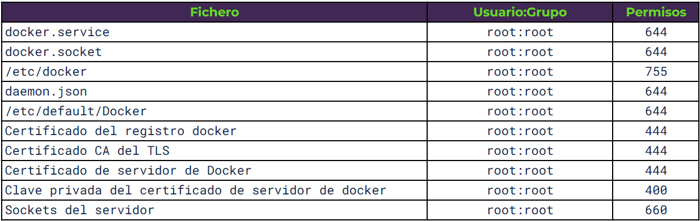

<div class="caption">
  Fuente: 
  <a href="https://reconshell.com/container-security-checklist/">Reconshell</a>.
</div>

Docker es una tecnología ampliamente usada, pero en la mayor parte de los casos, no se tienen en cuenta las políticas de securización y bastionado de las infraestructuras que basan su funcionamiento en estos contendores.

Tras leer múltiples artículos, libros y jugar con contenedores durante los últimos años, he decidido realizar una pequeña guía que resume los apuntes que he ido tomando a lo largo de los años. No me cabe duda que me dejo por el camino muchas técnicas y políticas de bastionado, pero creo que este artículo puede ahorrar mucho tiempo a alguién que quiera introducirse en los aspectos de seguridad de Docker.

Este post tiene en cuenta buenas prácticas del sector en cuanto al desarrollo de aplicaciones dentro de contenedores Docker. Para ello se han usado materiales de diferentes empresas especializadas en el desarrollo de soluciones de seguridad para contenedores y la guía CIS para Docker CE 1.3.1 (actualmente en su versión 1.5.0).

He intentado referenciar todo el contenido, sin embargo, no había planteado mis apuntes como un artículo desde un primer momento. Es por eso que he omitido algunas partes de mis apuntes, en los que considero, que no es correcto compartir ese contenido sin su referencia. En todo caso, agradecer el contenido a la comunidad.

## Índice

* 1_ Introducción
* 2_ Seguridad en contenedores
* 3_ Matriz de buenas prácticas
* 4_ Auditoría de la imagen
  * 4.1_ Buenas prácticas
  * 4.2_ Fichero .dockerignore
  * 4.3_ Múltiples ficheros compose
  * 4.4_ Permisos de los ficheros de configuración
  * 4.5_ COPY en vez de ADD en el Dockerfile
  * 4.6_ Análisis estático de vulnerabilidades
  * 4.7_ Puertos expuestos
* 5_ Integridad de la imagen
  * 5.1_ Latest
  * 5.2_ Comprobar cambios entre contenedor e imagen
  * 5.3_ Docker Content Trust
  * 5.4_ Docker Registry
  * 5.5_ Firma de imágenes
* 6_ Errores de configuración y remediación
  * 6.1_ DNS
  * 6.2_ Variables de entorno
  * 6.3_ Mapeo de puertos privilegiados dentro de contenedores
  * 6.4_ Docker Bench Security
* 7_ Auditoría del host
  * 7.1_ Creación de particiones separadas para los contenedores
  * 7.2_ Limitar los usuarios que pueden controlar el demonio de Docker
  * 7.3_ Autenticación en el cliente de Docker
* 8_ Permisos de la imagen en runtime
  * 8.1_ Usuario
  * 8.2_ Eliminar permisos de setuid y setgid
  * 8.3_ Redes
  * 8.4_ Restringir el tráfico entre contendores
  * 8.5_ Uso de recursos
  * 8.6_ Habilitar SELinux/AppArmor
  * 8.7_ Restricción de capabilities de Linux en el contenedor
  * 8.8_ No permitir la ejecución de contenedores privilegiados
  * 8.9_ No habilitar SSH en el contenedor
* 9_ Gestión de vulnerabilidades
* 10_ Monitorización
  * 10.1_ Gestión centralizada/remota de logs
* 11_ Aislamiento e investigación de incidentes
* 12_ Parcheo de vulnerabilidades
* 13_ Referencias

## 1. Introducción

Docker es una tecnología de _contenedorización_ que permite desplegar aplicaciones abstrayéndose del sistema operativo que se ejecuta por debajo. Aunque pueden parecer similares, la virtualización y la contenedorización son tecnologías con usos y cualidades diferentes.

En el caso de los contenedores, no se emula un sistema operativo completo, esto hace que los contenedores sean más rápidos y de menor tamaño que una máquina virtual. Otra diferencia clara es en la gestión, las máquinas virtuales requieren de un _hipervisor_ (VMM) que gestiona los recursos del equipo host para las distintas máquinas virtuales. Por otro lado, Docker usa un kernel compartido y el usuario interactúa con los contenedores mediante APIs y línea de comandos. 

Los contenedores son directorios aislados del resto del sistema de ficheros mediante el uso de los permisos del usuario. El contenedor es un sistema de ficheros dentro del sistema operativo, “enjaulado” de forma que sólo pueda salirse del contenedor mediante los puntos que se definan en el manifiesto del contenedor.


<div class="caption">
  Comparativa del stack en contenedores y máquinas virtuales. Fuente:  
  <a href="https://sysdig.com/blog/container-security-best-practices/">Sysdig</a>.
</div>

Al crear un contenedor, primero se debe definir una imagen, un fichero binario donde se definen todas las librerías necesarias para la ejecución de la aplicación que se busca _contenedorizar_. Un contenedor puede ejecutarse añadiendo todas las librerías de un sistema operativo, como Ubuntu, o añadiendo sólo las librerías mínimas necesarias, como Alpine o Busybox. 
La imagen contiene también metadatos, dependencias, requerimientos y detalles del sistema de ficheros que funcionan como una plantilla que usarán los contenedores. Esto permite versionar los contenedores y configurar su despliegue de forma automatizada (también su eliminación o políticas de escalado) usando otras herramientas compatibles como Jenkins, un _registry_ o kubernetes.

Un contenedor es independiente del Sistema Operativo y eso tiene muchas ventajas. Entre ellas, el parcheo y bastionado de los servidores. Los cambios efectuados sobre los sistemas operativos de los servidores raramente afectarán al contenedor. En sistemas automatizados el parcheo de vulnerabilidades se realiza eliminando el servidor, reinstalando la versión más actualizada del sistema operativo con todos los parches y volviendo a levantar el contenedor de nuevo.

## 2. Seguridad en contenedores

Un contenedor debería estar completamente aislado del servidor, siendo una capa de seguridad que impida a un atacante que tome el control de una aplicación el salir del contenedor o saltar a otros servidores de la red. Sin embargo, esto es un objetivo utópico. Se intenta que esto llegue a ser así, pero la realidad no es tan amable.

Un atacante que explote una vulnerabilidad dentro de un contenedor, combinada con metadatos expuestos y una credencial mal securizada puede comprometer toda una infraestructura cloud.

Como ya se ha dicho, los contenedores no son una máquina virtual, son un sistema de distribución de aplicaciones autocontenidas que permita ejecutar procesos aislados del resto del sistema. Este aislamiento usa namespaces del kernel para evitar emular un sistema operativo completo como haría una máquina virtual. Estas capas de abstracción faltantes, y la cercanía con el kernel, pueden llegar a permitir a un atacante salir del contenedor o entrar a él en un contendor mal configurado.

Las buenas prácticas de seguridad en contendores incluyen el sistema anfitrión, el entorno de ejecución del contendor, el cluster, el proveedor de infraestructura, la monitorización, el bastionado de las imágenes, la respuesta ante incidentes…


<div class="caption">
  Ciclo de la gestión de la seguridad en contenedores. Fuente:  
  <a href="https://sysdig.com/blog/container-security-best-practices/">Sysdig</a>.
</div>

Esto implica que debemos tener en cuenta todo el stack de cara a securizar una infraestructura de contenedores en todos los puntos de su ciclo de vida.

### 3. Matriz de buenas prácticas


<div class="caption">
  Matriz de buenas prácticas según el ciclo de gestión de la seguridad. Fuente:  
  <a href="https://sysdig.com/blog/container-security-best-practices/">Sysdig</a>.
</div>

### 4. Auditoría de la imagen

__4.1 Buenas prácticas__
* Usar imágenes pequeñas como Alpine, Busybox o Scratch. (O crearlas uno mismo)
* Usar imágenes especializadas. Si se necesita desplegar un servidor Apache, es recomendable usar una imagen especializada en Apache en vez de una con Ubuntu o Debian ya que será más pequeña y eficiente.
* Especificar la versión de la imagen base. Si queremos ejecutar una aplicación en python2.x y definimos que nuestra imagen es Ubuntu:Latest, con el tiempo puede que Ubuntu deje de dar soporte a python2.x y nos encontremos con que python3 causa problemas al ejecutar la aplicación. Se recomienda que se descargue Ubuntu:16:04 o una imagen con una versión concreta para evitar esto.
* Reducir el número de instrucciones en los Dockerfile. Por cada instrucción, Docker crea una capa que posteriormente tendrá que unir con el resto de capas en un estado consistente. Cuantas menos capas menos tardará este proceso.
* Borrar ficheros innecesarios. Si descargamos una librería .tgz al crear el contenedor, una vez instalada la librería es recomendable borrar el .tgz para reducir el tamaño de la imagen.
* Aprovechar la funcionalidad de creación de imágenes multifase.
* Reducir los ficheros que se envían al demonio de Docker con .dockerignore.
* El orden de las instrucciones en el dockerfile es importante. Docker crea una capa por cada nueva instrucción del dockerfile. Antes de crearla comprueba si ya existe en otro dockerfile para cogerla de la caché. Si detecta que una capa ha cambiado, invalida la caché de todas las subsiguientes instrucciones. Es recomendable ejecutar primero las instrucciones que sea más improbable que cambien.
* Reusar imágenes. Docker mediante la caché compartirá la misma imagen, ahorrando espacio. Recomendable cuando varios componentes corren en el mismo host.

__4.2 Fichero .dockerignore__

Este es un fichero que procesa el demonio de Docker a la hora de procesar el contexto. Docker ignora todos los ficheros y directorios listados en él. Permite eliminar todos los objetos innecesarios a la hora de crear la imagen. Esto permite que la imagen ocupe menos espacio y acelera su creación.

__4.3 Múltiples ficheros Compose__

Por defecto, Docker Compose busca el fichero `docker-compose.yml`, además de un segundo fichero llamado `docker-compose.override.yml`. Este segundo fichero extiende o sobrescribe la configuración del primero. Con `-f` se pueden usar ficheros override con nombres específicos como `docker-compose.test.yml` en el que configuremos la apertura de puertos y permisos especiales para el entorno de _test_ o de desarrollo o incluso para el uso de la aplicación por parte de administradores o un cliente concreto. Por ejemplo:

```
$ Docker-compose -f Docker-compose.yml -f docker-compose.admin.yml -f docker-compose.clienteA.yml run <nombreservicio> <comando>
```

Esto nos permitiría desplegar un entorno de contenedores específico para el _cliente A_ y preparado para ser usado por administradores.

De esta forma, evitamos errores en el despliegue y podemos automatizar casos específicos de negocio.

__4.4 Permisos de los ficheros de configuración en el demonio de Docker__


<div class="caption">
  Ciclo de la gestión de la seguridad en contenedores. Fuente:  
  <a href="https://0xword.com/es/libros/103-docker-secdevops.html">Docker: SecDevOps</a>.
</div>

__4.5 COPY en vez de ADD en el Dockerfile__

Hay dos instrucciones para copiar un archivo de sistema host a un contenedor, `COPY` y `ADD`. `COPY` sólo puede copiar ficheros de la máquina local donde se construye la imagen al sistema de ficheros de la propia imagen. `ADD` puede recuperar ficheros de URLs remotas y descomprimir el contenido automáticamente.
Son muy similares, pero debería favorecerse más el uso de `COPY`, `ADD` añade muchas vulnerabilidades potenciales en su uso.

__4.6 Análisis estático de vulnerabilidades__

Se puede definir un análisis estático del _Dockerfile_, pero no es hasta la construcción de la imagen cuando se descargan librerías y dependencias, que se puede verificar la seguridad. Cómo las imágenes son inmutables, el análisis estático es muy interesante realizarlo en una imagen construida. Algunas herramientas son:
* OpenSCAP
* Clair
* Anchore
* Dagda

__4.7 Puertos expuestos__

El comando `EXPOSE` en el _Dockerfile_ es un comando informativo que nos permite documentar los puertos expuestos en nuestro contenedor. No es obligatorio, pero es muy recomendable.

### 5. Integridad de la imagen

__5.1 Latest__

Cuando se tagea una imagen, _latest_ es una etiqueta confusa que puede causar errores y que debe evitarse. En entornos de producción se recomienda que se use una versión determinada y que en cada cambio se actualice la versión por una diferente, incluso en cambios mínimos. Esto es importante porque Docker también mantiene una caché y en caso de ver la misma versión podría no descargar dependencias que hayan cambiado. En caso de usar una imagen sin versión (_latest_) se recomienda hacer un `$ docker image pull <nombre de la imagen>` para forzar la descarga de la última versión en caso de que no sea la local.

Una imagen se puede etiquetar durante la creación de la imagen o con `$ docker image tag <tag>`.

__5.2 Comprobar cambios entre el contenedor y la imagen__

La imagen es un archivo que actúa a modo de plantilla a la hora de crear un contenedor. Es inmutable. Sin embargo, los contenedores tienen un ciclo de vida donde pueden cambiar elementos internos del contenedor. Muchas veces, es importante comprobar que cosas han cambiado para poder detectar anomalías, malos funcionamientos o intrusiones. Para ello se puede ejecutar el comando:

```
$ docker container diff <nombres del contenedor>
```

En la salida del comando, A significa que el fichero ha sido creado, C que el fichero ha sido modificado y D que ha sido eliminado.

__5.3 Docker Content Trust__

El hash `SHA256` tanto de las imágenes Docker como de sus capas nos permite verificar la integridad del contenido. 

Para ello, Docker permite firmar las imágenes al construirlas y verificar las firmas cuando se descargan de un registro en el que las hemos publicado.

Para activarlo se necesita dar valor a las variables:

* `DOCKER_CONTENT_TRUST`
* `DOCKER_CONTENT_TRUST_SERVER`

__5.4 Docker Registry__

Dentro de los entornos de desarrollo surge una nueva pieza necesaria para CI/CD, el Docker Registry. Es un almacén de imágenes de Docker disponibles en base a etiquetas y versiones. Cuando se construye una imagen, se le pasan diferentes pruebas funcionales, de seguridad y de rendimiento y en caso de pasarlas, se publica la imagen en el _registry_. Desde ese momento esa imagen puede ser descargada y usada por todas las personas y automatismo con acceso a dicho _registry_. El _registry_ puede ser público o privado. Unido a la inmutabilidad de las imágenes, asegura que el mismo código se ejecuta siempre en todos los entornos.

__5.5 Firma de imágenes__

Una vez se ha creado la imagen, se le han realizado diferentes controles y pruebas de seguridad y funcionalidad y ya está lista para ser distribuida y desplegada, se debe firmar la imagen. Esto sirve para garantizar que la imagen que descarguemos del _registry_ es la que nosotros creemos y no una copia maliciosa.

Para firmar las imágenes podemos usar __Notary__, esta herramienta sirve para publicar y verificar contenidos (no sólo imágenes Docker) en redes inseguras.

### 6. Errores de configuración y remediación

__6.1 DNS__

Docker permite configurar el DNS al que llamarán los contenedores para resolver dominios. En el caso de Iberpay son el 10.46.30.100 y 10.46.30.200.

```
docker containter run --dns=”10.46.30.100” -it ubuntu
```

__6.2 Variables de entorno__

Docker permite generar ficheros con variables de entorno, por defecto este fichero se llama `.env`

Una mala práctica es usarlas para almacenar contraseñas, API keys, tokens, etc. Docker implementó una funcionalidad llamada _secrets_ para almacenar estos valores.

Pueden verse fácilmente si usamos el comando:

```
$ Docker history <nombreimagen>
```

Para evitar la exposición de secretos a terceros, se delega el aprovisionamiento de secretos en un servicio específico. Una opción es hacerlo mediante los propios orquestadores de contenedores (Kubernetes, Docker Swarm, OpenShift…) Otra opción es que los contenedores, en su fase de arranque, recuperen los secretos desde un punto centralizado o KMS (Lemur o Vault)

__6.3 Mapeo de puertos privilegiados dentro de contendores__

Los puertos por debajo de 1024 son puertos privileagiados. Se necesitan permisos de root para hacer uso de ellos. Docker permite mapear un puerto del contenedor a un puerto privilegiado (el demonio de Docker lo permite porque tiene privilegios de _root_).

Si no se especifica el mapeo de puertos, Docker asigna uno aleatoreo entre el 49153 y el 65535 del _host_.

Una buena practica es no permitir que se asocie un puerto del contenedor a uno privilegiado de la máquina salvo casos que no quede más remedio.

__6.4 Docker Bench Security__

Es una herramienta que realiza pruebas para comprobar que se cumplen buenas prácticas de seguridad. Todos los test son automáticos y se basan en la guía CIS de Docker CE. Es recomendable su ejecución previa al despliegue del contenedor. Existen otras como __Kube-hunter, Linux-Bench, OSQuery, OVAL o Docker-bench__.

### 7. Auditoría del host

__7.1 Creación de particiones separadas para los contenedores__

Docker necesita almacenar en el host las imágenes que descarga, el sistema de ficheros de cada contendor, los metadatos para el funcionamiento de cada contenedor. Por defecto se almacenan en `/var/lib/Docker`, montado en `/` o en `/var`. Esto puede provocar que se llene el espacio de almacenamiento del _host_. Es recomendable montar ese directorio en una partición diferente para no afectar al _host_.

__7.2 Limitar los usuarios que pueden controlar el demonio de Docker__

El demonio de Docker requiere permisos de root. Este demonio controla y limita el acceso de los contenedores al _kernel_ del _host_. Por defecto sólo el usuario _root_ tiene permiso para controlar al demonio.

Cuando se añade un usuario al grupo Docker, al que inicialmente solo tiene acceso _root_. Ese usuario podrá conseguir permisos de _root_ sobre la máquina _host_. Esto se haría creando un contenedor con un volumen mapeado a `/` en la máquina host. Obteniendo así permisos sobre todo el _FS_ de la máquina _host_ desde el contenedor.

Se pueden ver los usuarios en el grupo de Docker con el comando:

```
$ getent group docker
```

__7.3 Autenticación en el cliente de Docker__

Por defecto, la autenticación del cliente de Docker se hace con la pertenencia del usuario al grupo Docker. Otra opción más segura es autenticar al usuario mediante un certificado en el cliente. Para ello se debe arrancar el demonio de Docker escuchando en un socket TCP con la autenticación TLS habilitada. Mediante el campo Common Name del certificado podrá autenticar al usuario y aplicar políticas de autorización usando plugins.

Este método de autenticación no requiere que el usuario esté en el grupo Docker del SO ni privilegios de root. Esto implica que con el certificado se puede ejecutar cualquier comando sobre el demonio de Docker. Es imprescindible que ese certificado se custodie de forma segura.

Hay muchos plugins para gestionar este tipo de autenticación, uno de ellos es Twistlock, este se puede ejecutar como un contenedor más en el host.

### 8. Permisos de la imagen en runtime

__8.1 Usuario__

Si no se establece un usuario por defecto, Docker ejecuta la imagen y los comandos como _root_. Si se establece el usuario, pero no el grupo, entonces el grupo por defecto es _root_. Esto implica que, si alguien consigue explotar una vulnerabilidad de los contenedores y salir del contenedor, entrará al servidor siendo _root_. Cuando el proceso ejecutado en el contenedor no necesite privilegios, es recomendable que se use un usuario para tal fin.

Para realizar esto, se puede añadir esto en el Dockerfile.

```
RUN useradd -d /home/miusuario -m -s /bin/bash miusuario
USER miusuario
```

Igual que puede sólo existir el usuario de _root_, podría darse el caso de que hubiese usuarios que no se están usando o que tengan permisos de _root_ innecesariamente. Es una buena práctica eliminar los permisos y usuarios que no se usen.

__8.2 Eliminar permisos de setuid y setgid__

Estos son permisos especiales que se asignan a directorios o archivos y que permiten a usuarios no _root_ el ejecutar esos archivos con privilegios de _root_ para realizar esa tarea específica.

Es una buena práctica eliminar estos permisos de los directorios en que no sean necesarios para prevenir una escalada de privilegios de un atacante. Pueden eliminarse durante la fase de construcción de la imagen:

```
RUN find / -perm + 6000 -type f -exec chmod a-s {} \; || true
```

__8.3 Redes__

A la hora de ejecutar un contenedor, Docker nos da diferentes controladores de red para el contenedor.

__Modo bridge__

Conecta todos los contenedores por defecto en una misma red privada. Aísla de la capa de red del _host_ con un _namespace_ y direccionamiento de red propio. Se considera la configuración más segura pero sólo puede usarse cuando el servicio despliega todos sus contenedores en un solo _host_. 
Para dar acceso a internet, o que los contenedores sean visibles en la red, se necesita usar NAT y redireccionar puertos. Usando este modo es posible tener varios servicios con diferentes IPs pero usando el mismo puerto, el mapeo de puertos evitará los conflictos.

En este ejemplo se corre un contenedor que mapea por NAT el puerto 80 del contenedor con el puerto 12000 del _host_.

```
$ docker container run -itd –name miservicio -p 12000:80 httpd
```

Es una buena configuración de red para aplicaciones simples que sólo necesiten un _host_.

Podemos ver los contenedores en la red bridge con:

```
$ docker network inspect bridge
```

__Modo host__

Es lo contrario a _bridge_. El aislamiento de la capa de red del contendor desaparece y compartirá el _namespace_ de red con el _host_. Si usamos esta opción, el contendor se expone automáticamente en la red en la que esté el _host_. Dos contenedores no podrán usar el mismo puerto en el mismo _host_ y las llamadas entre ellos serán vía _localhost_.
Se usan los recursos de red de forma más eficiente. Es una configuración recomendable para entornos que necesiten optimizar al máximo el uso de los recursos de red y de ejecución.

El contenedor tiene acceso a todas las interfaces de red de la máquina, esto es peligroso y debería evitarse.

__Overlay__

Está diseñado para entornos con más de un _host_. Es usado para crear clusters en Docker Swarm. Permite cifrar las comunicaciones con el parámetro -opt encrypted.

__MacVLAN__

Permite configruar varias capas tipo 2 en una única interfaz física, permite crear varias sub-interfaces de red virtuales (VLAN) con MACs e IPs distintas en cada interfaz.

__8.4 Restringir el tráfico entre contendores__

Por defecto, el tráfico de red entre máquinas del mismo _host_ está habilitado. Si no es necesario, se puede restringir todo el tráfico entre máquinas que no se haya definido explícitamente.

```
$ dockerd --icc=false
```

En caso de que el contenedor sea comprometido, un atacante no podrá comunicarse con otros contenedores en el _host_ que no hayan sido especificados. Pero si hay un puerto del _host_ que haya sido mapeado con el contenedor, el atacante podrá usarlo.

__8.5 Uso de recursos__

Un contenedor usará todos los recursos de la máquina _host_ si no se limita. Se puede comprobar si el _host_ soporta esta funcionalidad con el comando:

```
$ docker info
```

Si aparece un warning avisando de que no está soportado, puede activarse en el fichero `/etc/default/grub` modificando la línea `GRUB_CMDLINE_LINUX` con:

```
GRUB_CDMLINE_LINUX=”cgroup_enable=memory swapaccount=1”
```

```
$ sudo update-grub
```

Para limitar la memoria que puede usar el contenedor está la opción `-m` y para la cpy el parámetro `--cpus`. Existen multitud de comandos para limitar recursos de forma más concreta.

__8.6 Habilitar SELinux/AppArmor__

Son sistemas de gestión y control de acceso a recursos del sistema. Buscan llegar a mínimo privilegio necesario sin implementar paradigmas complejos. Permiten listar a que recursos puede acceder un usuario o proceso, evitando cualquier comportamiento no permitido por sus políticas.
Permiten implementar paradigmas de seguridad como MAC (Mandatory Access contorl), MLS (Multi-Level security), RBAC (Rol based Access control) o TE (Type enforcement).

__8.7 Restricción de capabilities de Linux en el contenedor__

Por defecto Docker restringe _capabilities_ de Linux de los contenedores en ejecución. Es posible añadirle o quitarle capabilities adicionales. Es una buena práctica quitar todas las que no sean necesarias. Las capabilities por defecto son:

* AUDIT_WRITE
* CHOWN
* DAC_OVERRIDE
* FOWNER
* FSETID
* MKNOD
* KILL
* NET_BIND_SERVICE
* NET_RAW
* SETFCAP
* SETUID
* SYS_CHROOT

__8.8 No permitir la ejecución de contenedores privilegiados__

Los contenedores pueden ejecutarse con `--privileged`. Esto les otorga permiso para usar todas las capabilities de Linux. Al hacer esto, el contenedor obtiene casi todos los permisos de ejecución del _host_, llegando a permitir ejecutar Docker dentro de Docker. NUNCA debería necesitarse ejecutar un contenedor de esta forma.

__8.9 No habilitar SSH en el contenedor__

No es necesario habilitar SSH, Docker provee métodos para acceder al interior del contenedor a través de su API. La buena práctica es entrar en el servidor y desde el acceder al contenedor mediante el cliente de Docker. Si existe un servidor SSH en el contenedor, debe desinstalarse.

### 9. Gestión de vulnerabilidades

La gestión de vulnerabilidades en un contenedor no es diferente de como se realiza en otros sistemas. Una vez que se saben las vulnerabilidades del contenedor, se deben priorizar las que necesiten ser corregidas más urgentemente. La prioridad puede ser en base a si existen exploits públicos, si pueden ejecutarse de forma remota, si son fáciles de explotar y si los informes de inteligencia avisan de que se usan comúnmente.

Debe haber un procedimiento para sistematizar la corrección de vulnerabilidades que facilite a los desarrolladores calendarizar estos trabajos.

Crear excepciones para vulnerabilidades que no tengan impacto. Esto reduce el ruido y permite priorizar y centrarse en vulnerabilidades más críticas.

### 10. Monitorización

__10.1 Gestión centralizada/remota de logs__

Docker tiene una API para obtener los logs, mediante terminal se puede ejecutar:

```
$ Docker logs <contenedor>
```

Docker soporta múltiples drivers de logs que se pueden configurar en función de la infraestructura.

* None
* Json-file
* Syslog
* Journald
* Gelf
* Fluentd
* Awslogs
* Splunk
* Etwlogs
* Gcplogs

### 11. Aislamiento e Investigación de incidentes

En caso de un incidente, los contenedores deben estar preparados para ser parados y estar listos para un proceso de auditoría forense. Generalizando, es necesario poder parar un contendor, crear una copia del volumen de almacenamiento, aislar el contenedor de la red permitiendo al experto forense acceder a él desde un punto seguro que evite la infección en otros sistemas y finalmente eliminar el contenedor.

Mientras tanto, en paralelo, el servicio debe estar preparado para lanzar una replica del contenedor que se va a aislar de forma que no haya perdida de servicio.

Una herramienta para aislar contenedores es __Gatekeeper__. Que permite definir políticas de aislamiento con Kubernetes.

### 12. Parcheo de vulnerabilidades

Hay que elegir la base de nuestras imágenes con cuidado. Una base insegura legará todas sus vulnerabilidades a nuestra imagen. Una base sin mantenimiento nos forzará a cambiarla en algún momento debido a la falta de parches. Siempre es preferible usar imágenes oficiales y verificadas como base. Cuando se usen imágenes personalizadas, construye tu propia imagen base ya que la que viene con una imagen descargada no tiene garantías de origen. Muchas veces las imágenes oficiales no son la mejor opción para el caso de uso, en este caso verifica al desarrollador de la imagen, la frecuencia de las actualizaciones, la firma de __Docker Content Trust__, pasa un escaneo de vulnerabilidades y busca si tiene soporte.

Para parchear la imagen, hay que actualizar la versión de la imagen base en el _dockerfile_ y reconstruir la imagen encima de la imagen base actualizada. No siempre es necesario ir a la última versión si esta rompe alguna funcionalidad. Es bueno definir una estrategia de versionado:

* Usar versiones estables o con soporte a largo plazo.
* Preparar la migración a nuevas versiones antes de que acabe el plazo de soporte.
* Reconstruir las imágenes periódicamente con una estrategia de actualización similar sobre los packetes y dependencias dentro del contenedor.

## 13. Referencias

Materiales que he consultado para elaborar este artículo:

* [Docker: SecDevOps](https://0xword.com/es/libros/103-docker-secdevops.html)
* [Sysdig: Container Security Best Practices](https://sysdig.com/blog/container-security-best-practices/)
* [CIS: Securing Docker](https://www.cisecurity.org/benchmark/docker)
* [Reconshell: Container Security Checklist](https://reconshell.com/container-security-checklist/)

**Gracias** por leer este artículo. Si tienes alguna **duda**, comentario o simplemente quieres decir un hola... puedes **contactarme** en [Twitter](https://twitter.com/coke727), el formulario de contacto o incluso señales de humo =P
