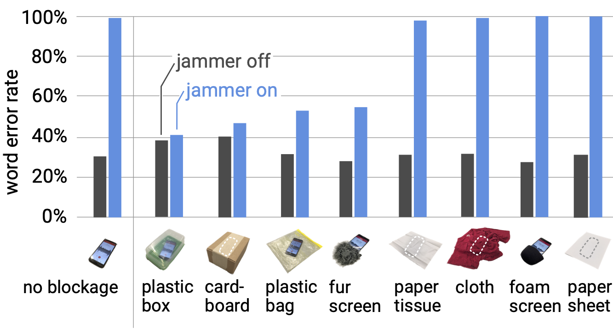

Las **[JASyP](https://interferencias.tech/jasyp/)** (Jornadas de Anonimato, Seguridad y Privacidad) fueron las primeras jornadas en las que me subí a un escenario a dar una charla, parece que no pero ya han pasado 5 años desde esa primera charla sobre __Certificate Transparency__ en el salón de actos de informática en la Universidad de Granada. La verdad que es un evento al que le tengo mucho cariño, de hecho he repetido como ponente y como asistente todos los años desde entonces y... *No regrets*, cada año ha sido imperdible por su ambiente, sus charlas y la gente que se acerca a Granada. Si queréis saber un poquito más, podéis seguirles en Twitter en [@inter_ferencias](https://twitter.com/Inter_ferencias), son mazo majos.


<div class="caption">
  Imagen de 
  <a href="https://www.instagram.com/outofhandrew/?hl=es">Andrew Brumagen</a>.
</div>

Este año les he engañado para que me dejen hablar de inhibidores de microfonos, hace un par de años descubrí un paper muy interesante que trataba sobre cómo evitar que los micrófonos a nuestro alrededor fuesen capaces de captar nuestra voz usando para ellos ultrasonidos. El paper me llamó mucho la atención porque no sólo hablaba de __jammers__ de micrófonos, sino que además lo mezclaba con __wearables__, impresión 3D y daba las pautas para crear uno DIY con un presupuesto muy ajustado. Ya en su momento tenía un *hype* enorme, y me vine muy arriba comentándolo con [@terceranexus6](https://cybre.space/web/accounts/212064). Debido a la crisis de los componentes, pandemias, volcanes, guerras y otras excusas... no he tenido mucho ánimo para ponerme con ello. Hasta que *redoble de tambores*... anunciaron el [CFP de las JASyP 2022](https://gitlab.com/interferencias/propuestas-jasyp/-/tree/main/propuestas/2022) ¡Presenciales y en Granada! Y me parecio una señal para volver a arrancar en esas jornadas donde di mi primera charla allá por 2017.


**<center>El mundo gira alrededor de la tecnología, es inevitable el estar relacionado con ella. El teléfono móvil se ha convertido en una necesidad, ya no sólo en el día a día, lo necesitamos para interactuar con las administraciones públicas o las empresas que proveen servicios esenciales. La domótica se conecta a asistentes de voz. En breve los wearables estarán cosidos a nuestra ropa... Cuantos más sensores a nuestro alrededor, menos certeza de nuestra privacidad.</center>**

¿Son las empresas éticas al tratar nuestros datos? No podemos asegurarlo, el software es difícilmente auditable, más cuando está alojado en entornos cloud. ¿Cómo podemos seguirle el ritmo a la tecnología sin perder nuestra privacidad?

**<center>No se puede, pero al menos podemos ponérselo más difícil a las empresas que no gestionan nuestros datos correctamente. Contra el espionaje... autodefensa y contra los micrófonos... inhibidores.</center>**

## Índice
Introducción:

* 1_ El problema de la privacidad y los micrófonos
* 2_ Inhibir dispositivos (AKA Jamming)]

Investigación académica:

* 3_ Érase una vez un paper
* 4_ Repercusión en las redes

Montar el dispositivo:

* 5_ Lista de la compra
* 6_ ¿Cómo montar el dispositivo?

Pruebas:

* 7_ Demos
* 8_ Disclaimer

Conclusiones:

* 9_ Agradecimientos
* 10_ Referencias

## 1. El problema de la privacidad y los micrófonos

Hace unos años nos habríamos escandalizado de ver a alguién sacando fotos por la calle en un hospital, un colegio, administraciones públicas o mismamente la oficina. Sin embargo, nuestra tolerancia a esto esta creciendo esponencialmente junto con la tecnología. Nuestra privacidad es un concepto que se ha desdibujado con los años, la forma de socializar es completamente distinta y el compartir nuestra vida privada en internet es un punto fundamental para lograrlo.

No sé cuál será mi percepción en el futuro, pero a día de hoy, pienso que la compartición de nuestros datos privados en las redes es tan salvaje que los problemas que venimos temiendo desde hace años están empezando a aflorar. Y con ello, empieza a haber más gente que se da cuenta del problema que esto supone.

Asistentes de voz, *smartphones*, portátiles, el termostato, la tostadora... parece que todo lleva cámaras o micrófonos. En nuestro entorno cada vez hay más sensores y cada vez son más pequeños e imperceptibles. Estás con una persona y coloca el móvil encima de la mesa, con la pantalla mirando hacia la mesa. Esto es muy habitual y lo vemos a diario en multitud de situaciones ¿Cómo sabemos que ese móvil no está grabando? Lo mismo sucede con los asistentes de voz, entramos en una estancia cualquiera y no nos llama la atención ese _altavoz_ de la estanteria lleno de micrófonos.

Las personas __tenemos derecho__ a que no nos graben sin nuestro conocimiento, tenemos derecho __a la intimidad y a la privacidad__. Si esto no se cumple, no podemos ser libres. Un entorno en que todas tus palabras pueden ser usadas en tu contra es un entorno estresante, en que tenemos que medir nuestras palabras y en que alguien malintencionado puede sacar de contexto una conversación o simplemente publicarla con el objetivo de hacer daño.

El problema no es que nos puedan grabar, sino que no tenemos herramientas para evitar que esto no pase cuando nosotros deseamos que no se nos grabe. En este aspecto podemos hablar de evitar __reconocimiento facial__, __grabaciones de vídeo__ con cámaras ocultas, protección de nuestros __datos biometricos__, borrado de __nuestros__ datos en servicios digitales... 
Los campos en los que seguir trabajando por la defensa de nuetro derecho a la privacidad son (*por desgracia*) todos, ya que los intereses comerciales se centran más en explotar nuestros datos que en evitar su captación. Tanto es así, que los servicios digitales modernos se centran en incitar al usuario a generar datos para poder procesarlos.

__¿2077 será un año en que las personas sigan entrando al juego de regalar sus datos a cambio de que un número sea más alto en la pantalla?__ Antes de eso llegará un momento en que los problemas sociales serán tan graves que el dilema será el de *Ludismo o barbarie*.

## 2. Inhibir dispositivos (AKA Jamming)

Abordar todos los ataques que recibe nuestra privacidad es una tarea inabarcable. Una forma de empezar muy práctica es investigar sobre cómo evitar las grabaciones de audio.

Para ello primero tenemos que entender que es el sonido. El sonido es una propagación de energia en forma de onda que viaja a través de un medio material a una determinada frecuencia. Cuando esa onda llega a nuestro oído, hace vibrar el tímpano.
Según la forma de la onda, el tímpano vibra de distinta manera y el cerebro interpreta esa información como sonido.

Los micrófonos usan el mismo concepto que nuestro oído para captar el sonido. [Hay muchos sistemas](https://es.wikipedia.org/wiki/Micr%C3%B3fono#Tipos_de_micr%C3%B3fono), pero como concepto general podemos decir que usan un material que vibra con el sonidoy que permite convertir esa vibración en señales electricas.

Los humanos podemos escuchar el sonido que oscila entre los 20 y 20000 hercios (Hz). Por debajo de los 20Hz es lo que llamamos __infrasonido__ y por encima de los 20 KHz es lo que llamamos __ultrasonido__.

Teniendo esto en cuenta, lo lógico es que un micrófono capte el sonido en la frecuencia auditiva de los humanos (20-20000 Hz). Grabar en otras frecuencias es posible, pero no podríamos escucharlo cuando ese sonido se reproduzca en un altavoz.

Con este concepto en mente, muchos dispositivos electrónicos usan ultrasonidos para comunicarse entre si, sin molestar a los usuarios y sin necesitar Wi-Fi para ello. Un ejemplo es el [asistente de voz de Google](https://www.androidauthority.com/google-assistant-smart-display-ultrasound-1170898/), que lo usa para detectar la presencia de personas y activarse o para leer configuraciones enviadas desde otros dispositivos.


<div class="caption">
  No podía pasar la oportunidad de referenciar el lema de  
  <a href="https://interferencias.tech">Interferencias</a>.
</div>

Y aquí es donde entre el concepto de __[jamming](https://es.wikipedia.org/wiki/Interferencia_intencionada)__. Es una técnica en que emitimos una onda con una frecuencia que perturbe otra transmisión. Por ponerlo en claro, emitimos ruido para que el receptor de la transmisión no sea capaz de recuperar la información que se le envía.
*Si tu hablas, yo voy a hablar más alto para que no se te escuche por encima de mi voz*. Esta técnica no sólo se aplica al sonico, sino a cualquier frecuencia. Existen Jammer para Wi-Fi, Radio, Bluethoot... en definitiva para cualquier información transmitida en una frecuencia determinada.

En el caso de los micrófonos, hay muchos dispositivos en el mercado que permiten interferir con diferentes técnicas sus sensores.
A día de hoy no son un producto interesante para el consumidor medio. Entre otras razones, porque: son aparatosos, son caros, son direccionales y no son móviles.

La direccionalidad es el mayor problema, si tenemos que apuntar al micrófono entonces tenemos que saber que ese micrófono existe. Si hay dos micrófonos en direcciones opuestas entonces tendremos que elegir. Para solucionar esto hay dispositivos con forma de media esfera para solucionar ese problema. Pero son muy grandes, pensados para proteger una habitación pero no al usuario.


<div class="caption">
  El dispositivo de la foto es uno de estos inhibidores, su precio es de aproximadamente 8000€ y promete inhibir 360 grados a su alrededor.
</div>

Hay bastantes tipos de inhibidores, las diferencias están en la distancia, el ángulo máximo de interferencia, la técnica que usan y el medio que usan para transmitir la interferencia (láser, eléctromagnética o ultrasonidos). 

## 3. Érase una vez un paper

El inhibidor que he montado se basa en un [*paper*](https://dl.acm.org/doi/pdf/10.1145/3313831.3376304) de la Universidad de Chicago y que fue publicado en abril de 2020 por Yuxin Chen, Huiying Li, Shan-Yuan Teng, Steven Nagels, Zhijing Li, Pedro Lopes, Ben Y. Zhao y Haitao Zheng.


<div class="caption">
  Esquema conceptual del dispositivo.  
  <a href="https://dl.acm.org/doi/pdf/10.1145/3313831.3376304">Fuente</a>.
</div>

En el paper proponen un método para interferir micrófonos mediante ultrasonidos. Esto es muy conveniente ya que el dispositivo no molesta a su usuario, que suponiendo que sea un humano y no un replicante, no es capaz de escuchar frecuencias de ultrasonidos.

¿Por qué somos capaces de interferir una frecuencia audible con una que no lo es? Al parecer, los investigadores usaron un descubrimiento previo en que se revelaba que los micrófonos que ellos llaman *comodity* (entiendo que se refieren a los tipo [MEMS](https://es.wikipedia.org/wiki/Micr%C3%B3fono#Micr%C3%B3fono_microelectromec%C3%A1nico_(MEMS))) capturan el sonido de forma no lineal. Esto causa que cuando se convierte la onda de ultrasonidos en una señal eléctrica, parte de ese ultrasonidos es convertido de forma ¿errónea? en una señal electrica correspondiente a la frecuencia de la voz humana.

De esta forma, emitiendo ultrasonidos podemos añadir ruido a la información que capta el micrófono en el momento en que convierte el sonido en una señal eléctrica. La técnica es efectiva e interfiere tanto la señal de la voz humana que la convierte en un ruido molesto e ininteligible.


<div class="caption">
  El dispositivo jammer.  
  <a href="https://dl.acm.org/doi/pdf/10.1145/3313831.3376304">Fuente</a>.
</div>

A lo largo del paper se documentan diferentes pruebas de uso con esta solución, para ello usan como referencia un software de reconocimiento de voz y hacen una valoración en base a cuantas palabras es capaz de reconocer dicho software cuando el dispositivo inhibidor está en funcionamiento. En este estudio se detalla el ángulo de efectividad que tienene los micrófonos y la distancia efectiva en que son capaces de inhibir un micrófono. 


<div class="caption">
  Otro punto muy interesante es el de las medidas anti-jamming, en esta gráfica se ve distintos materiales cubriendo el micrófono y su efecto en la interferencia. 
  <a href="https://dl.acm.org/doi/pdf/10.1145/3313831.3376304">Fuente</a>.
</div>

Para probar esta técnica hacen uso de un dispositivo en forma de pulsera que cuenta con 32 transductores de ultrasonidos que emiten en frecuencia de ultrasonidos, concretamente en 20-25 Khz de frecuencia. La pulsera tiene una autonomía de hasta 4 horas con la configuración software y hardware que detallan. Esta prueba de concepto tiene un alcance de unos 12 metros y su forma de pulsera intenta mitigar el gran fallo de esta técnica, que los transductores de ultrasonidos son direccionales.
El funcionamiento es sorprendentemente bueno y aunque tiene algunos ángulos muertos cumple con su objetivo.

Lo más interesante del proyecto tras el *paper* es que, junto con el documento, han liberado un repositorio con el [código](https://github.com/y-x-c/wearable-microphone-jamming/tree/master/jammer_hardware_source) y los archivos .STL para imprimir en 3D. Si bien las conexiones entre componentes hardware no se detallan, si que se listan los componentes y en el código pueden deducirse algunas de las conexiones necesarias para hacer funcionar el dispositvo. 

## 4. Repercusión en las redes

Este *paper* ha tenido una amplia difusión entre medios e influencers de las redes sociales entre el 2020 y 2021, no sería raro que reflote cada pocos meses y se vean nuevos proyectos derivados.

Dejando a un lado medios escritos, que sólo se hacen eco de la nota de prensa en la mayor parte de los casos, hay varios canales de YouTube en los que se han montado pruebas de concepto. En este proyecto me parece más interesante referenciar un medio visual ya que el verlo en funcionamiento es bastante espectacular.

Naomi Wu (@RealSexyCyborg) replica el proyecto y hace pruebas de campo en bares de su ciudad. Lo interesante de su proyecto es que plantea el dispositivo como un collar en vez de como una pulsera.
Al ser emisores direccionales, justifica que es mejor que la dirección sea la misma que la de nuestra voz. En el video enseña su proceso de diseño del collar, el ensamblaje y las pruebas de campo.
Destacar que libera en [este repositorio](https://github.com/sexycyborg/Wearable-Audio-Jammer) los planos de la PCB que prototipa, se pueden usar para pedir las PCB a fábricas y conseguir un producto hardware DIY más profesional, estable y resistente.

Por alguna razón no funciona embeber este vídeo, os dejo en enlace: [https://www.youtube.com/watch?v=H1rozZ7ebxQ](https://www.youtube.com/watch?v=H1rozZ7ebxQ)

Otro canal que me ha parecido muy relevante es el de [@justanengineer](https://www.youtube.com/channel/UCtmLRg2y3KlNF_FXeyA04DQ), realiza un prototipo mínimo y simplificado al extremo para probar el funcionamiento detallado en el paper. Es muy destaclable el análisis que hace del espectro de frecuencia que realiza con el móvil. Previo a este vídeo, el canal ya hizo pruebas usando [una técnica similar](https://www.youtube.com/watch?v=YBQ7A4W0bTo).

<iframe 
    width="560" 
    height="315" 
    src="https://www.youtube-nocookie.com/embed/PcTkMWJb_Gs" 
    title="YouTube video player" 
    frameborder="0" 
    allow="accelerometer; autoplay; encrypted-media; gyroscope; picture-in-picture" 
    allowfullscreen></iframe>

Otro proyecto muy interesante es el de Allison Burcht ([@irl](https://twitter.com/irl)). Su [prueba de concepto](https://allisonburtch.github.io/mic-jammer) apareció en 2015 y usa la misma técnica, previa al *paper* de la Universidad de Chicago.
Me gusta mucho el diseño del dispositivo y el caso de uso que plantea, un pequeño dispositivo para poner al lado de los móviles de los comensales de una mesa. Muy interesante para reuniones que necesiten un margen de privacidad.

<iframe 
  width="560"
  height="315"
  src="https://player.vimeo.com/video/120425709?h=305dec22d4" 
  frameborder="0"
  allow="accelerometer; autoplay; encrypted-media; gyroscope; picture-in-picture"
  allowfullscreen></iframe>

## 5. Lista de la compra

Si quieres probar a montar uno por tu cuenta te va a tocar dejarte unos euros por el camino. Si bien es verdad que su precio unitario no es muy alto, comprar las piezas por separado es complicado.
Suelen venir en packs de varias piezas, si no dispones de alguna toca comprar un pack entero y el dispositivo se encarece bastante. Lo más interesante sería hacer pedidos grupales para abaratar el precio.

### Prototipo funcional completo
Este es el presupuesto de un prototipo autónomo con hasta 10 emisores.

* [AdaFruit Pro Trinket - 5v 16MHz](https://www.amazon.es/gp/product/B0131VM9I0) 17.52€
* [PAM8403](https://www.amazon.es/gp/product/B07J2Q9554) 5.99€
* [AD9833](https://www.amazon.es/gp/product/B09MD9LRDR) 10.99€
* [NU25C16T/R](https://es.aliexpress.com/item/4000760514545.html?gatewayAdapt=glo2esp&spm=a2g0o.order_list.0.0.21ef194dXEsGEI) 28.84€
* [TP4056](https://www.amazon.es/gp/product/B08ZYLPY62) 11.04€
* [Batería 3.7V 500mA](https://www.amazon.es/gp/product/B09R3Z8VZQ) 11.50€

El total es de __133.56€__. Si no quieres una versión autónoma, puedes no comprar la batería y el TP4056. Esto lo dejaría en un total de __111.02€__. No listo gastos de envío, materiales desechables, herramientas y otros objetos comunes en un taller como pueden ser cables, multímetros, estañadores...

Lo que más encarece el precio son los emisores de ultrasonidos NU25C16T/R. Este emisor es difícil de conseguir en España y el importarlo de China encarece el componente y tarda en llegar bastante.
En el proyecto original del paper se usan 36 emisores, en este presupuesto sólo se cuentan 10.

El resto de componentes no tienen por que se necesariamente los que enlazo, otras versiones del mismo componente funcionarán exactamente igual. Se puede reducir el precio consiguiendo un arduino más barato que el de Adafruit por ejemplo. Cualquiera con SPI valdrá para este proyecto.


<div class="caption">
  Prototipo completo en perspectiva. 6 x 4 cm. No tiene batería, depende de un ordenador o <i>power bank</i>.
</div>

### Prototipo de prueba mínimo

Si sólo quieres comprobar el funcionamiento, hay una versión mínima que usa el arduino como amplificador y modulador de la onda. Este dispositivo es mucho más barato pero tiene un alcance de menos de 30 centímetros. Sin embargo, es una buena opción para probar que funciona la técnica.

* [AdaFruit Pro Trinket - 5v 16MHz](https://www.amazon.es/gp/product/B0131VM9I0) 17.52€
* [NU25C16T/R](https://es.aliexpress.com/item/4000760514545.html?gatewayAdapt=glo2esp&spm=a2g0o.order_list.0.0.21ef194dXEsGEI) 28.84€

El total es de __46.36€__. Existe la opción de en vez de usar un emisor de ultrasonidos de 25 KHz, usar uno de 40KHz. Hay que modificar mínimamente el código y el alcance no superará los 10 centímetros. Sin embargo, este componente puede consegurise fácilmente en España como parte
del componente [HC-SR04](https://www.amazon.es/ultras%C3%B3nico-KYYKA-distancia-compatible-Duemilanove/dp/B08RDJ1WM9).


<div class="caption">
  Prototipo mínimo funcional. Imagen original de 
  <a href="https://github.com/T-vK">@T-vK</a>.
</div>

## 6. ¿Cómo montar el dispositivo?

La documentación no es muy explicita en este apartado, el código oficial del *paper* da algunas pistas sobre que pines se usan pero no hay una documención gráfica o completa al respecto.
El mejor punto para entenderlo es la [issue#6](https://github.com/y-x-c/wearable-microphone-jamming/issues/6) del repositorio. Aquí hablan de materiales y pruebas realizadas por la comunidad
para replicar el prototipo de la investigación.


<div class="caption">
  Esquema original de 
  <a href="https://github.com/y-x-c/wearable-microphone-jamming/issues/6#issuecomment-596074096">@T-vK</a>.
</div>

El código para hacer funcionar el dispositivo está en el [repositorio oficial](https://github.com/y-x-c/wearable-microphone-jamming/tree/master/jammer_hardware_source/arduino_code/wearable_microphone_jammer), no me ha hecho falta adaptarlo para hacer que funcione.
El archivo principal hace uso de *AD9833.h* y *DigitalWriteFast.h* para funcionar.

```C 
#include "AD9833.h"

#define FNC_PIN A0
#define SEL_PIN A1

int gen_freq = 25000;

int RXLED = 17;  // The RX LED has a defined Arduino pin

//--------------- Create an AD9833 object ----------------
// Note, SCK and MOSI must be connected to CLK and DAT pins on the AD9833 for SPI
AD9833 gen(FNC_PIN);       // Defaults to 25MHz internal reference frequency

void setup() {
  //start gen
  gen.Begin();
  pinMode(SEL_PIN, OUTPUT);
  //set gen to SINE
  gen.ApplySignal(SINE_WAVE, REG0, gen_freq);
  //start gens
  gen.EnableOutput(true);
  //put both PGAs at max output
  MCP41010Write(255, SEL_PIN);
  SPI.setDataMode(SPI_MODE2);
}

void loop() {
  gen.ApplySignal(SINE_WAVE, REG0, random(24000, 26000));
  MCP41010Write(255, SEL_PIN);
}

//  function below adapted from http://henrysbench.capnfatz.com/henrys-bench/arduino-output-devices/mcp41010-digital-potentiometer-arduino-user-manual/
//  8bit value to write --> 256 levels --> value 0 to 255
void MCP41010Write(byte value, int CS)
{
  SPI.setDataMode(SPI_MODE0);
  // Note that the integer vale passed to this subroutine
  // is cast to a byte
  digitalWrite(CS, LOW);
  SPI.transfer(B00010001); // This tells the chip to set the pot
  SPI.transfer(value);     // This tells it the pot position
  digitalWrite(CS, HIGH);
}
```

En caso de querer usar unos transductores de 40 KHz, es necesario modificar el código, en la [issue#6](https://github.com/y-x-c/wearable-microphone-jamming/issues/6#issuecomment-599793129) se comparte el código necesario.

```C 
// Mic jammer code adjusted for 40khz

#include "AD9833.h"

#define FNC_PIN A0
#define SEL_PIN A1

int gen_freq = 40000;

int RXLED = 17;  // The RX LED has a defined Arduino pin

//--------------- Create an AD9833 object ----------------
// Note, SCK and MOSI must be connected to CLK and DAT pins on the AD9833 for SPI
AD9833 gen(FNC_PIN);       // Defaults to 25MHz internal reference frequency

void setup() {
  //start gen
  gen.Begin();
  pinMode(SEL_PIN, OUTPUT);
  //set gen to SINE
  gen.ApplySignal(SINE_WAVE, REG0, gen_freq);
  //start gens
  gen.EnableOutput(true);
  //put both PGAs at max output
  MCP41010Write(255, SEL_PIN);
  SPI.setDataMode(SPI_MODE2);
}

void loop() {
  gen.ApplySignal(SINE_WAVE, REG0, random(39000, 41000));
  MCP41010Write(255, SEL_PIN);
}

//  function below adapted from http://henrysbench.capnfatz.com/henrys-bench/arduino-output-devices/mcp41010-digital-potentiometer-arduino-user-manual/
//  8bit value to write --> 256 levels --> value 0 to 255
void MCP41010Write(byte value, int CS)
{
  SPI.setDataMode(SPI_MODE0);
  // Note that the integer vale passed to this subroutine
  // is cast to a byte
  digitalWrite(CS, LOW);
  SPI.transfer(B00010001); // This tells the chip to set the pot
  SPI.transfer(value);     // This tells it the pot position
  digitalWrite(CS, HIGH);
}
```

## 7. Demos
Tras replicar el dispositivo, he hecho varias pruebas para comprobar como de bien funciona. Las pruebas se han hecho con un solo emisor de ultrasonidos conectado.


<div class="caption">
  Prueba realizada sobre un micrófono Hyper-X.
</div>

Se ha probado sobre diferentes móviles y micrófonos. Como regla del pulgar, sólo funciona en micrófonos integrados de tamaño reducido, creo que serían los tipo [MEMS](https://es.wikipedia.org/wiki/Micr%C3%B3fono#Micr%C3%B3fono_microelectromec%C3%A1nico_(MEMS). Los micrófonos de grabación como el Hyper-X de la foto no se ven afectados, se escucha un poco de ruido de fondo pero no es casi perceptible.

### Distancia
El *paper* asegura conseguir unos 12 metros de distancia efectiva usando su pulsera con un array de 36 emisores. En mi caso, con un sólo emisor, he conseguido una distancia de casi 2 metros en línea recta desde el emisor de ultrasonidos y el micrófono.

<iframe 
  class="audio"
  src="https://drive.google.com/file/d/1sJQwJl8m1eTonIFKkUVPC5b3q5inm2ab/preview" 
  width="640"
  allow="autoplay"></iframe>

### Ángulo
En cuánto al ángulo, la pulsera tiene un ángulo de unos 180º según el estudio. No se habla de si tiene algún ángulo muerto en esa franja. Mi prototipo con un sólo transmisor tiene ángulo funcional de alrededor de __40º__. No he hecho unas pruebas muy rigurosas, más bien funcionales.
En las JASyP ReD comentó de buscar las especificaciones del transductor. En ellas dice que el ángulo del componente es de __60º ± 15º__, esto va en la línea de mis mediciones.

<iframe 
  class="audio"
  src="https://drive.google.com/file/d/1u5exvPgZPS3a_97NiMKvA2BL-nHC9U0h/preview" 
  width="640"
  allow="autoplay"></iframe>

### Alexa
Uno de los casos de uso más interesantes es el de los asistentes de voz. Funciona muy bien contra los asistentes de voz.

Por alguna razón no funciona embeber este vídeo, os dejo en enlace: [https://drive.google.com/file/d/18ND9SL_cHwGRnLvfKXw7mPKL9li7LtHB/view?usp=sharing](https://drive.google.com/file/d/18ND9SL_cHwGRnLvfKXw7mPKL9li7LtHB/view?usp=sharing)

## 8. Disclaimer
__En la investigación se menciona que los ultrasonidos pueden ser perjudiciales para el oido humano o de los animales. Ni yo ni mi gato Moka hemos sufrido ningún efecto negativo o perceptible, sin embargo, no me he dedicado a meterme el transmisor en el oído a ver si escuchaba algo... tened cuidad a la hora de manipular los emisores ya que emiten a unos 90 dB, un sonido a partir de 100dB empieza a ser perjudicial.__

## 9. Agradecimientos

Esta investigación no habría sido posible sin los ánimos de [@terceranexus6](https://cybre.space/web/accounts/212064). Muchas gracias también a [@inter_ferencias](https://twitter.com/Inter_ferencias) por la oportunidad de presentarlo este año en las JASyP. Agradecer también a los asistentes a la charla por sus dudas, portátiles con analizadores de espectro de frecuencia e ideas sobre el proyecto, ha sido una charla muy divertida.


Si quieres ver **más** sobre esta presentación, te animo a ver las **[diapositivas](https://docs.google.com/presentation/d/1jSsRg2QUbNv-p0CKfb4dGIhiutF44dbNGonEt6GzxUE/edit?usp=sharing)** de la charla.

**Gracias** por leer este artículo. Si tienes alguna **duda**, comentario o simplemente quieres decir un hola... puedes **contactarme** en [Twitter](https://twitter.com/coke727), el formulario de contacto o incluso señales de humo =P

**No dudes en preguntarme cualquier duda vía Twitter, email o el formulario de la página principal.**

## 10. Referencias

Los enlaces más interesantes del proyecto:

* [Universidad de Chicago: Web oficial del paper](https://sandlab.cs.uchicago.edu/jammer/)
* [Allison Burcht: Mic Jammer](https://allisonburtch.github.io/mic-jammer/#:~:text=The%20Mic%20Jammer%20is%20an,sensitive%20range%20of%20the%20mic.)
* [GitHub: Repo oficial](https://github.com/y-x-c/wearable-microphone-jamming)
* [GitHub: Paper repo / Issue #6](https://github.com/y-x-c/wearable-microphone-jamming/issues/6)
* [Github: Naomi Wu Repo](https://github.com/sexycyborg/Wearable-Audio-Jammer)
* [Youtube: Bloqueador de Micrófono Ultrasonico Cyberpunk](https://www.youtube.com/watch?v=H1rozZ7ebxQ)
* [Youtube: Simplest, cheapest, effective DIY ARDUINO ultrasonic Microphone Jammer / DIY ultrasound Audio Jammer](https://www.youtube.com/watch?v=PcTkMWJb_Gs)
* [Wikipedia: Micrófonos](https://es.wikipedia.org/wiki/Micr%C3%B3fono)
* [Wikipedia: Jamming](https://es.wikipedia.org/wiki/Interferencia_intencionada)