**
This article has not yet been translated yet. You can try to read it in Spanish or using a translating tool. I will try to translate it in the future.
**

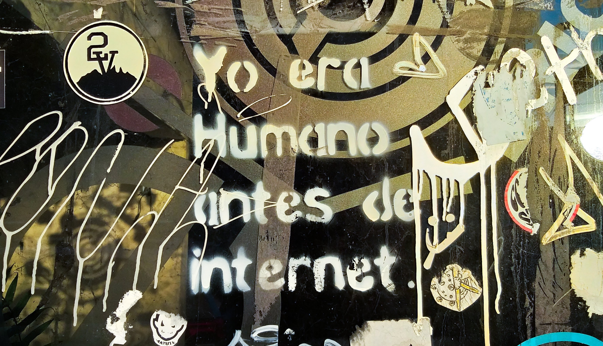

  Fuente <a href="https://unsplash.com/photos/-LgRxki8234">Unsplash</a>.

**
Desde hace ya unos cuantos meses me llevaba planteando el hecho de mejorar mi red Wi-Fi. En principio no me planteé nada demasiado complejo pero después de echarle una pensada acabe por caer en la sensualidad de los router mesh. Aquí os cuento mi experiencia durante la semana que llevan funcionando, qué opciones he visto en el mercado y como he acabado por configurar la red para que sea un poco más segura.
**

No sé si esto será un sentimiento generalizado, pero creo que en algún momento cualquier persona que haya leído los primeros capítulos de un libro de fundamentos de redes siente la curiosidad por barrer un poco su red interna y dejarla reluciente no sea que venga visita.

El problema con esto es que no siempre se entiende todo lo que se hace y los routers no suelen ponerlo fácil, ~~sobretodo si son los que nos dan los ISP~~. Después de tantos años, miro las mismas configuraciones que antes me parecían indescifrables y me enorgullece el entender ese "idioma arcano" (O casi todo). Hace casi un año **me decidí a invertir en la red interna de mi casa** y dejar de cumplir ese manido _En casa del herrero, cuchillo de palo_, pero como soy como soy... no me valía un router normal. Ya que estaba, pues me embarcaba en una aventura con todas las variables que puedan salir mal juntas y así me las quito de un plumazo.

**¿Qué en qué me metí?** En probar redes de [Wi-Fi mallado](https://es.wikipedia.org/wiki/Red_inal%C3%A1mbrica_mallada) (AKA Mesh).

## Wi-Fi mesh

Las redes Wi-Fi mesh ([WMN](https://en.wikipedia.org/wiki/Wireless_mesh_network)) son un conjunto de nodos en una topología de malla que se comunican mediante algún tipo de protocolo wireless. El área que comprenden todas las áreas de cobertura de los diferentes nodos se llama Mesh Cloud y para enrutar el tráfico entre los nodos, se usa el protocolo HWMP (Hybrid Wireless Mesh Protocol AKA [IEEE 802.11s](https://en.wikipedia.org/wiki/IEEE_802.11s)).

Este protocolo define cómo se deben conectar los dispositivos de una red para crear una red mesh. Este tipo de redes son P2P (Una mesh cloud podrían operar con múltiples tecnologías Wi-Fi a la vez) y no definen diferentes roles funcionales o de seguridad, la autenticación entre dispositivos está basada en claves intercambiadas mediante [SAE](https://en.wikipedia.org/wiki/Simultaneous_Authentication_of_Equals) en el momento de emparejamiento de los dispositivos de la red.

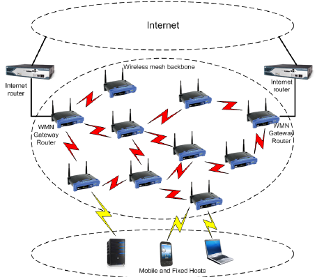

  Diagrama de una topología mesh. Fuente:{' '}
  <a href="https://www.researchgate.net/figure/Diagram-of-a-Wireless-Mesh-Network_fig1_234015211">
    Rui L. Aguiar
  </a>
  .

Un punto a tener en cuenta es el que estas redes pueden actualizarse con relativa facilidad añadiendo nodos nuevos, sin necesidad de tener que sustituir los antíguos. Pese a esta forma de evitar la obsolescencia, no son dispositivos comunes en los hogares y suelen tener precios más altos que un router normal. En el caso de los dispositivos domésticos, se plantean para casas grandes o con muchas paredes y lo normal es comprarlos en packs de dos o tres unidades. Debido a su precio hay que plantearse si son la elección que mejor se ajusta a nuestro problema o si estamos gastando en unas funcionalidades que no nos van a aportar nada respecto a opciones más baratas.

## Modelos

Casi un año investigando sobre marcas y gamas de precios suelen dar para una lista muy larga de referencias, sin embargo, en el caso de los router mesh la lista de posibilidades es bastante corta. Aún más, si descartas de plano opciones que te dan "mal yuyu" pese a ser buenas opciones calidad-precio. **¿Qué marcas tenemos ahora mismo en el mercado?** Os comento un poco por encima, porque este post tampoco pretende ser una comparativa y no me he documentado tanto como para ello. Los precios los he sacado de las estadísticas de [Keepa](https://keepa.com), un tracker de precios para Amazon y Ebay que no viene nada mal ahora que se acerca el [Black Friday](<https://es.wikipedia.org/wiki/Viernes_negro_(compras)>).

- TP-Link
- Google
- Asus
- Netgear
- Ubiquiti
- Linksys
- Huawei
- Tenda

Por lo que he ido viendo, tampoco he hecho una investigación exhaustiva, los mejores en cuanto a prestaciones son los de **Asus**, aunque, prepárate para sacar la billetera (Pack de **2 ZenWifi** tiene un precio medio de **320€** o los **RT-AX92U**, 2 por un precio medio de **410€**). Los **Netgear Orbi** son también muy buena opción pero los **RBK23** (el pack de 3 tiene un precio medio de **330€**) tienen una cobertura de metros cuadrados algo más pequeña que la competencia (al menos sobre papel) y los router satélite no pueden hacer de router principal.

Una de las mejores opciones calidad-precio son los **Google Wifi**, el pack de 3 tiene un precio medio de **260€**, no son los más potentes pero son fáciles de configurar, son pequeños, estéticos y dan un servicio estable... el si queréis meter un dispositivo de Google en vuestra red interna (nada menos que un router), lo dejo a vuestra elección... Yo he preferido evitarlo.

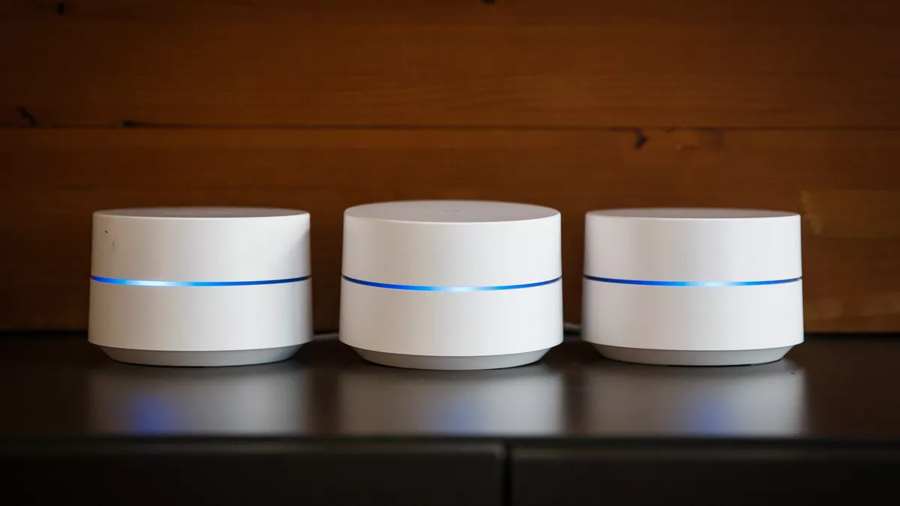

  Son bastante bonitos. Fuente:{' '}
  <a href="https://www.cnet.com/es/analisis/google-wifi-opiniones/">CNET</a>.

Comentando esto con un compañero, me llamaba paranóico (un poco quizá sí) y argumentaba que al final todas las compañías pueden espiarnos. En mi caso, ya le doy suficientes datos a Google donde no me queda más remedio y prefiero separar mis huevos en más de una cesta, preferiblemente en una segunda cesta que no se hable con la de Google. En tema de datos, prefiero distribuirlos mucho antes que dárselos todos a uno, pero eso ya es filosofía.

Volviendo al tema, otra marca bastante interesante es [Ubiquiti](https://www.ui.com), todos los productos de esta gente **molan muchísimo**, en el caso de puntos de acceso y [WiFi Mesh](https://eu.store.ui.com/collections/unifi-network-access-points) no se quedan atrás, les mola la innovación y el efecto _WoW_ y se nota en como cuidan la estética y la usabilidad de sus productos. La verdad que me habría gustado tirar por esta opción y en tema de precios es algo cara pero no se va demasiado de los rangos del mercado. Sin embargo, quería algo más sencillo de instalar en mi casa, sin comerme demasiado la cabeza en configuraciones, precios y tipos de dispositivos (La cantidad de modelos para cada caso específico es impresionante).

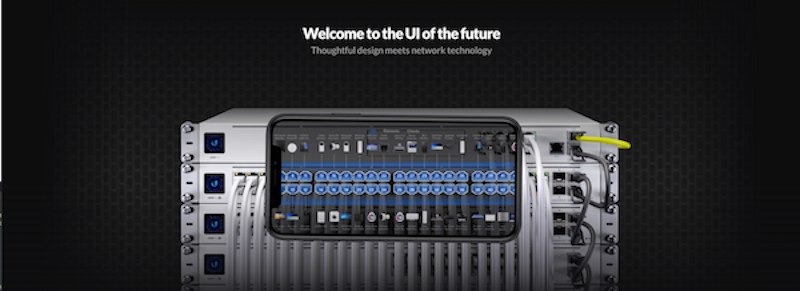

  Tienen una app de realidad aumentada para saber que está conectado a cada puerto O.O.

Los de Tenda y Huawei no les miré demasiado. Resaltar que **Huawei** son muy baratos, pero de una gama muy baja, los **Q2 Pro** en el pack de 3 tienen un precio medio de **130€** pero su ancho de banda es de 200MB, que a año 2020 me parece un poco justo.

### TP-Link

Al final y después de mucho escuchar recomendaciones y ver precios, me he decantado por TP-Link. Ya he tenido routers suyos con los que estoy muy contento y que siguen en uso después de muchos años. Su gama mesh se llama Deco, tienen unos 10 modelos distintos con diferentes características. Los más visibles son los de la serie M (M4, M5, M9 Plus) y hay packs de 1, 2 o 3 dispositivos. Si hablamos de packs de 3, los M4 tienen un precio medio de 166€ y los M9 de 320€. Al verlos con una buena rebaja, he optado por los M9 Plus. Cualquiera de ellos puede ser router o sátelite.

Tienen dos puertos Ethernet para conectar por cable algún dispositivo extra y puede conectarse entre ellos vía cable de ser necesario. Sobre el papel cubren hasta 600 metros cuadrados y soportan Bluetooth y Zigbee, algo que está interesante si en un futuro me da por meter _smartcosas_ en casa (Porque de meter alguna, no van a estar conectadas a internet).

Estéticamente me han parecido bastante discretos, mi idea es colocarlos en la pared, ya he visto que en Thingiverse hay [modelos](https://www.thingiverse.com/search?q=tp-link+deco+m9&type=things&sort=relevant) de soportes para imprimir. Por otro lado, mi casa tiene muchas paredes y he preferido optar por una solución que cubra la máxima superficie posible.

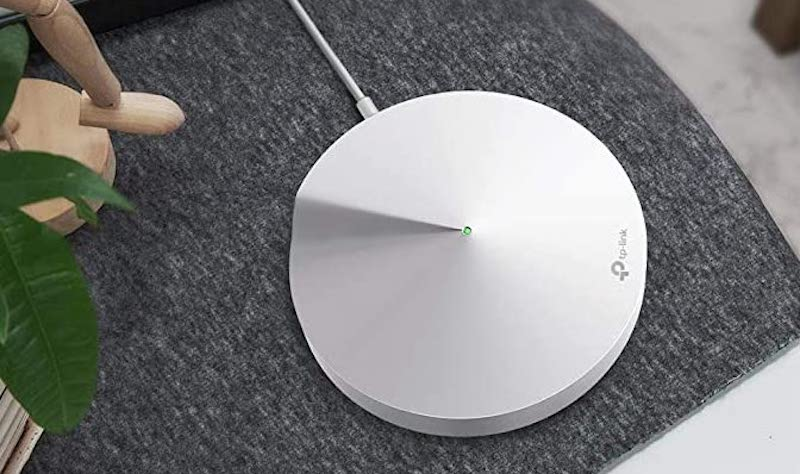

Deco M9 Plus.

Otra cosa que me ha llamado la atención es que los M9 incorporan de serie la base de amenazas de [Trend Micro](https://www.trendmicro.com) y un [NIPS](https://es.wikipedia.org/wiki/Sistema_de_prevenci%C3%B3n_de_intrusos) de la misma compañía. Lo dividen en tres servicios que se pueden activar y desactivar individualmente pero no dan opción a configurarlos o ver qué está pasando entre bastidores, una pena no poder bichearlo.

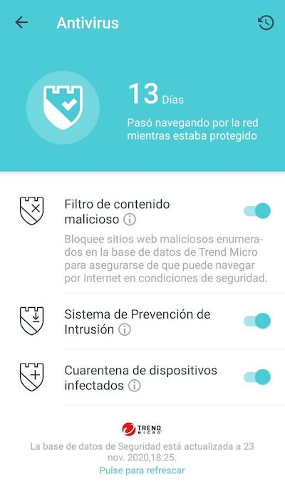

  Ya me ha salido algún aviso de que la web que intento acceder es peligrosa al navegar por
  internet, no está mal.

## Mi nueva red Interna

Estos cacharritos dan muchas posibilidades de cara a configurar una red interna. El hecho de permitir desplegar una red de invitados, las mil posibilidades de configuración que da la app móvil y el disponer de puertos ethernet en los tres router da mucho en que pensar y también influye en donde poder colocarlos.

### Colocación física

Al parecer, cada uno de los routers llega a unos 200 metros cuadrados, no tengo tan claro que esa medida sea cierta pero no he tenido tiempo para medir la intensidad de señal (aún), cuando tenga un rato actualizaré esta sección con esas mediciones. Para una casa con varias plantas creo que son una opción muy acertada, ya que colocándolos bien es fácil eliminar áreas a las que no llega la señal. Sin embargo, en un piso creo que puede ser una solución sobredimensionada (también dependerá de las paredes del piso ojo).

En mi caso, he aprovechado la pared del hueco de las escaleras para colocar cada dispositivo en una planta y que entre ellos no haya obstáculos que puedan interferir en la señal. Decir que he tenido mucha suerte con los enchufes, ya que de no haber habido a mano en alguna de las plantas me habría tocado hacer más ingeniería para decidir cómo colocarlos.

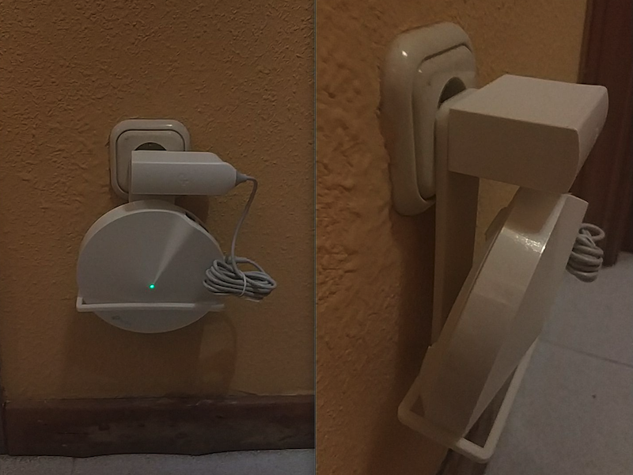

  No me gusta la conexión que hace, a mayores, la estructura se ha doblado un poco por el peso.

Para anclarlos a la pared he decidido imprimir un [soporte muy sencillo](https://www.thingiverse.com/thing:4642787) que se engancha al propio enchufe. Esto me ha evitado el tener que hacer agujeros y el resultado final es muy limpio. Aún así, no me convence del todo, este modelo de soporte en concreto hace que la conexión con el enchufe baile un poco y no me da mucha seguridad. No he encontrado ningún soporte para imprimir que me acabe de convencer (y no quiero dejarme 50€ en comprar un pack de 3) por lo que acabaré por remixear este modelo que he impreso para que agarré en el cargador del dispositivo en vez de en la clavija del enchufe y de paso haré que deje un poco más de espacio entre el TP-Link Deco y el enchufe para evitar interferencias con la línea eléctrica.

### La aplicación de TP-Link

Probablemente lo que más me ha gustado de todo este tema ha sido la aplicación de TP-Link para sus router mesh. Desde hace ya unos años tenía un TP-Link de gama baja que tenía también aplicación y permitía configurar cosillas... ¡Pero lo de los Deco es otro nivel!

En vez de daros mucho la brasa, casi mejor si os pongo unas capturas de la aplicación. Pero por darles un poco de contexto, os resumo rápidamente:

- Crear una red Wi-Fi de invitados con un click.
- Ver el estado de todos los routers mesh conectados a la red.
- Ver todos los dispositivos conectados y poder darles prioridad de conexión.
- Configurar un servicio NoIP (DDNS) pulsando un botón.
- Reservar IPs.
- Activar/Desactivar IPv6.
- Control Parental.
- Antivirus (El NIPS de Trend Micro).
- QoS.
- Configurar el DNS primario y secundario.
- Perfiles de automatización sobre smartcosas conectadas.

Sé que son cosas que pueden hacerse en la mayoría de routers, pero la facilidad con que se hacen desde la aplicación móvil es impresionante...

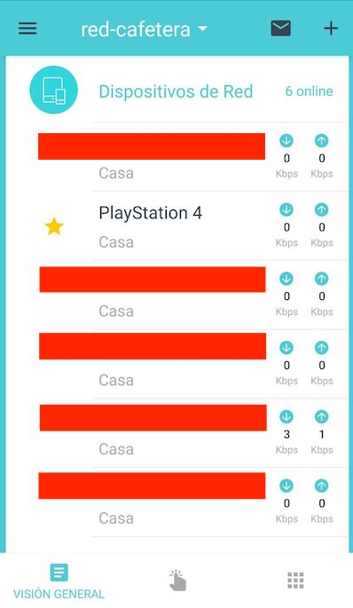

Listado de dispositivos conectados.

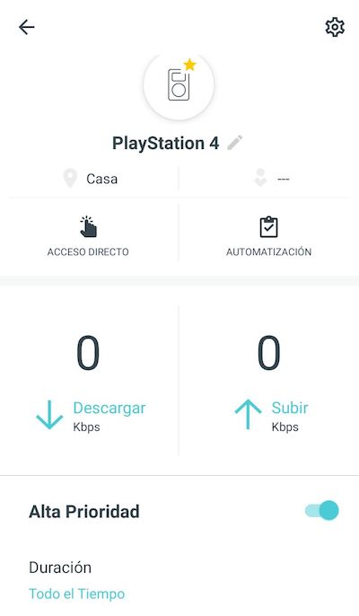

Detalle de un dispositivo conectado con prioridad de ancho de banda.

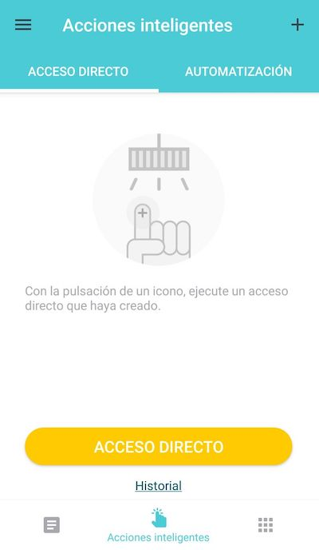

Panel de automatización, como podéis ver tengo muchas smartcosas en casa.

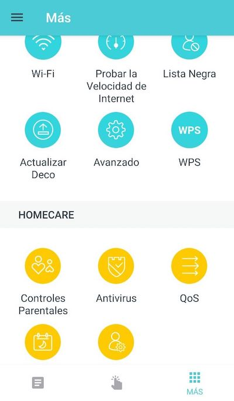

Opciones extra, las más interesantes.

### Red privada y para invitados

La aplicación permite generar una red de invitados muy fácilmente. Tema de un par de pulsaciones y poner una contraseña. Pensé que me dejaría crear múltiples redes Wi-Fi, pero sólo permite crear la red privada y la de invitados.

A falta de ver cómo creo una tercera red, he decidido sacrificar la red de invitados para meter ahí todas las smartcosas (de las que por desgracia no puedo prescindir) que prefiero que no anden compartiendo mi tráfico de red.

¿Qué cosas? Pues la SmartTV, los asistentes de voz, las aspiradoras, dispositivos para hacer streaming a la televisión, consolas... menos mal que aun no he perdido la batalla de las neveras, cafeteras, termostatos, luces, enchufes, pulseras, mascotas... no veo aún la necesidad de que sean inteligentes y no quiero ver el momento en que la puerta me pida dinero para abrirse...

En definitiva, si una bombilla de marca NiSú quiera mandarle mis datos a una nube random o actuar como puerta trasera... va a quedarse ahí confinada con el resto de entes sospechosos... a ver si con suerte se espían entre ellos y mi red interna la dejan en paz. No sé cómo de efectivo será esto, pero mejor una red segmentada que todo en la misma ¿No?

Más adelante configuraré un router específico para estas cosas y volveré a liberar la red de invitados (Que tendrán que conectarse a la red interna... pero me fio más de ellos, sinceramente).

### Monitorización

La verdad que la aplicación da un sistema de monitorización básico pero muy sencillo de entender. Es interesante que me llegue una notificación al teléfono si un dispositivo se conecta a mi red o poder ver qué dispositivos están enviando datos en todo momento.

Lo veo una buena opción para un usuario con pocos conocimientos técnicos que quiere tener algo de control sobre lo que pasa en su red. A mi quizá se me queda un poco corto, pero de momento no tengo tiempo para andar configurando un sistema de monitorización de red en casa.

Quizá en los próximos meses me lance a ello, si alguno de los que me leéis sabéis de alguna herramienta o cacharro para hacer eso sin morir en el intento escribidme por el [Twitter <3](https://twitter.com/Coke727) y me contáis porque tampoco ando muy puesto en el tema.

### DNS

Aquí iba a ir un apartado sobre el DNS que he configurado con Anti-Spam, bloqueador de publicidad, listas negras de sitios maliciosos y bloqueador de trackers tanto en web como de dispositivos inteligentes del hogar... pero creo que este post me está quedando muy largo.

El próximo artículo del blog que escriba será sobre eso, ya veréis que pasada de servicio he encontrado por internet. Es gratis pero aun así la cantidad de servicios que da es impresionante... al menos en mi red, se ha vuelto un imprescindible a partir de ahora.

## Conclusiones

A día de hoy todavía no he podido probar los Deco M9 el tiempo suficiente para dar un juicio sobre ellos, pero en este par de semanas ha quedado claro que la conexión es mucho más estable y el ancho de banda llega prácticamente entero a todos los dispositivos de la casa (Cosa que agradecen mis compañeros de trabajo).

De momento, creo que el sistema Wi-Fi Mesh es la leche. Aun así, si tu casa no tiene unas paredes que parecen hechas con plomo, este sistema puede que sea algo excesivo (además no es barato). En ese caso quizá te compense más comprar un router algo mejor de lo normal o decantarte por modelos como el Deco M4 que son más baratos y te van a dar un servicio muy similar (aunque no tendrán ese NIPS tan sexy de Trend Micro). También es interesante que este tipo de red es ampliable, a futuro en vez de tener que almacenar en el trastero el router viejo, puedes usarlo como un satélite e ir actualizando asi la red de la casa de forma aditiva y no sustitutiva.

Por último, la aplicación móvil lo veo diferencial. El configurar una red en minutos, poder monitorizarla, automatizar acciones sobre ella... todo del el móvil y siempre con un par de pulsaciones y todo bien explicadito. Así sí.

Si te da por dejarte los monedos en una de estas cosas, creo que vas a acabar contento. Quizá un poco prematuro, pero creo que vale cada euro.
